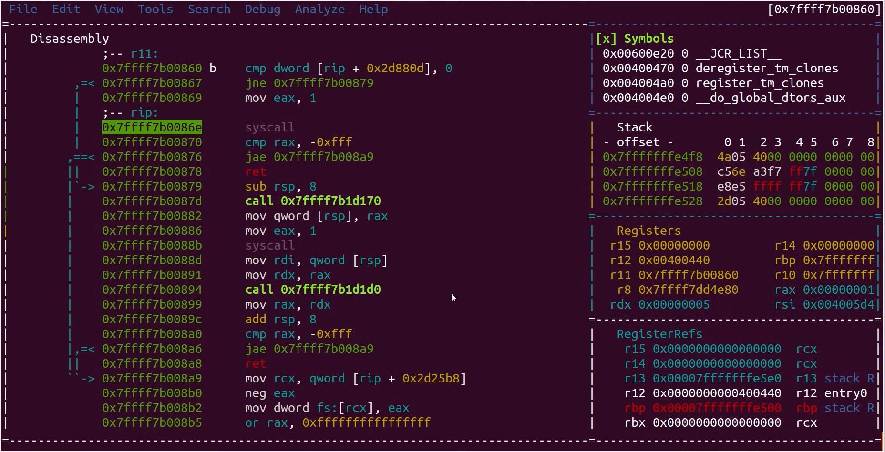

# Sistemski pozivi 2

## Kako funkcioniraju sistemski pozivi?

Prisjetimo se primjera iz prošlotjedne vježbe:

```c title="L05_hello_world.c"
#include <stdlib.h>
#include <stdio.h>

int main(int argc, char const *argv[]) {
    int day = 20, month = 4, year = 2024;
    printf("%d. %d. %d.\n", day, month, year);
    return 0;
}
```

```bash
gcc L05_hello_world.c -o L05_hello_world
strace ./L05_hello_world
```

Vidimo da je funkcija `printf` zapravo *wrapper* za sistemski poziv `write`. Funkcija `write` prihvaća tri argumenta:

- Referencu na izlazni tok podataka (u ovom slučaju `1` označava standardni izlaz)
- Adresu znakovnog niza (dovoljno je proslijediti znakovni niz, prevoditelj će se pobrinuti za alokaciju memorije)
- Duljinu znakovnog niza (broj bajtova, u ovom slučaju 13)

Struktura i sadržaj binarne datoteke može se vizualizirali uz pomoć [dijagnostičkih alata](https://rada.re/n/radare2.html). Na slici je prikazan poziv funkcije `write` kako bismo bolje razumjeli kako se program ponaša tijekom izvršavanja:



Obratite pozornost na dvije linije:

```bash
mov eax, 1
syscall
```

`SYSCALL` je instrukcija koja će prebaciti način izvršavanja iz korisničkog (razina privilegije 3) u jezgreni (razina privilegija 0) i pozvati rutinu *system call handler*. U tom koraku, potrebno je prepoznati koji sistemski poziv korisnički program želi izvršiti (jer postoji mnogo različitih sistemskih poziva). Jezgra učitava identifikacijski broj sistemskog poziva iz `eax` registra, provjerava njegovu valjanost i prema [tablici sistemskih poziva](https://filippo.io/linux-syscall-table/) pronalazi fiksnu adresu na kojoj je definiran željeni sistemski poziv. [Više o *system call handler*-u](https://litux.nl/mirror/kerneldevelopment/0672327201/ch05lev1sec3.html)

## Zadaci za vježbu

### Zadatak 1: Tablica kvadrata

Tablica kvadrata pruža prethodno izračunate vrijednosti kvadrata za različite ulazne vrijednosti. Napišite program koji generira tablicu kvadrata i zapisuje ju u datoteku. Ime datoteke te početna i konačna vrijednost za koju je potrebno izračunati kvadrat zadaju se kao CLI argumenti programu. Ako zadana datoteka ne postoji potrebno ju je dodati, a ako postoji potrebno je izbrisati sav sadržaj iz nje prije zapisa tablice drugog korijena.

import Tabs from '@theme/Tabs';
import TabItem from '@theme/TabItem';

<Tabs>
  <TabItem value="primjer" label="Primjer u C-u">

```c title="L05_sqr.c"
#include <stdlib.h>
#include <stdio.h>
#include <math.h>
#include <string.h>

#define BUFF_MAX 16


int main(int argc, char const *argv[]) {
  if (argc < 4) {
    perror("Please provide all args");
    return 0;
  }

  const char *filename = argv[1];
  int from, to;
  sscanf(argv[2], "%d", &from);
  sscanf(argv[3], "%d", &to);

  FILE *fp = fopen(filename, "w");
  if (fp == NULL) {
    perror("Can't open output file");
    return 1;
  }

  if (fprintf(fp, "N\tSQR(N)\n") < 0) {
    perror("Error writing output file");
    return 1;
  }
  for (int i = from; i <= to; i++) {
    if (fprintf(fp, "%d\t%d\n", i, i * i) < 0) {
      perror("Error writing output file");
      return 1;
    }
  }

  if (fclose(fp) != 0) {
    perror("Error on close");
    return 1;
  }

  return 0;
}
```
```bash
gcc L05_sqr.c -lm -o L05_sqr
strace -c ./L05_sqr L05_sqr.txt 4 12
cat L05_sqr.txt
```

  </TabItem>
  <TabItem value="predlozak" label="Predložak">

```bash
#!/bin/bash

# Skripta prima tri argumenta, i to redom: filename, from, to

# Zapišite zaglavlje u datoteku čiji naziv (filename) je korisnik proslijedio kao argument
# Zaglavlje: "N\tSQR(N)"

# Izračunajte kvadrat brojeva u rasponu [from, to] te rezultate zapišite
# u izlaznu datoteku.
```
```bash
chmod +x L05_sqr.sh
rm L05_sqr.txt
strace -c ./L05_sqr.sh L05_sqr.txt 8 20
cat L05_sqr.txt
```
  </TabItem>
</Tabs>

Komentirajte vrijeme izvršavanja programa za kreiranje tablice kvadrata brojeva pisanog u C-u i u Bash-u. Vrijeme izvršavanja naredbe, programa ili skripte možemo dobiti koristeći naredbu `time`. [Više o mjerenju vremena izvršavanja](https://stackoverflow.com/a/47478852/11497334)

```bash
time ./L05_sqr L05_sqr.txt 4 5000
time ./L05_sqr.sh L05_sqr.txt 4 5000
```

### Zadatak 2: Kopiranje sadržaja datoteke

Pokrenite sljedeću naredbu kako biste stvorili datoteku veličine 100 MiB:

```bash
dd if=/dev/zero of=L05.data bs=1M count=100
```

Nadopunite naredbu u idućem bloku tako da kopira sadržaj datoteke `L05.data` u `L05_kopija.data`. Sadržaj treba kopirati u blokovima s time da:
- U prvom slučaju koristite blokove maksimalne veličine 1 MiB (1024 * 1024 bajtova)
- U drugom slučaju koristite blokove maksimalne veličine 20 MiB (20 * 1024 * 1024 bajtova)

Usporedite ova dva scenarija.

**Pomoć:**
- Kopiranje datoteke u blokovima je moguće realizirati koristeći alat `dd`
- Nazivi ulazne i izlazne datoteke se specificiraju pomoću parametara `if` *(input file)* i `of` *(output file)*, npr. `dd if=in.txt of=out.txt`
- Pomoću parametra `bs` *(block size)* može se specificirati maksimalna veličina bloka u bajtovima prilikom kopiranja. Moguće je koristiti i sufikse M, MB, K, KB, ...

### Zadatak 3: Informacije sustava

Iskoristite dani predložak i napišite C program koji ispisuje:
- proteklo vrijeme od pokretanja sustava u minutama
- količinu radne memorije te koliko je radne memorije slobodno u bajtovima
- veličinu diskovnog prostora i slobodnog prostora za `/home/student`
- provjerite jesu li se funkcije `sysinfo` i `statvfs` uspješno izvršile

Ispravnost svog programa provjerite tako da ispise usporedite sa ispisima naredbi `uptime`, `free -b` i `df -B 1`.
Koristite dokumentaciju prilikom rješavanja zadatka: `man sysinfo` i `man statvfs`.

**printf formats:**
- long `%ld`
- unsigned long `%lu`
- unsigned int `%u`
- unsigned short `%hu`

```c title="L05_sysinfo.c"
#include <stdlib.h>
#include <stdio.h>
#include <sys/sysinfo.h>
#include <sys/statvfs.h>

int main(int argc, char const *argv[]) {
  struct sysinfo info;
  int ret = sysinfo(&info);

  if (ret == -1) {
    printf("Greska\n");
    return -1;
  }
    
  printf("Proteklo vrijeme od pokretanja sustava: ... min\n");
  printf("\n");
  printf("RADNA MEMORIJA\n");
  printf("\tSveukupno: ... B\n");
  printf("\tSlobodno: ... B\n");
  printf("\n");

  struct statvfs stat;
  ret = statvfs("/home/student", &stat);
  /*if (provjerite je li funkcija statvfs javila gresku) {
    printf("Greska\n");
    return -1;
  }*/

  printf("POHRANA (/home/student)\n");
  printf("\tSveukupno: ... B\n");
  printf("\tSlobodno: ... B\n");
  

  return 0;
}
```

```bash
gcc L05_sysinfo.c -o L05_sysinfo && ./L05_sysinfo
```
