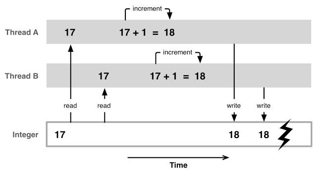

# Dretve

U ovim vježbama fokusirat ćemo se na problem utrkivanja i međusobno isključivanje *(mutex)* kao tehniku sinkronizacije koja rješava taj problem.


Prije pisanja višedretvenih programa, pažljivo razmotrite maksimalan broj dretvi koje će biti korisne za paralelizaciju zadatka. Ako računalo ima više CPU jezgri, možete koristiti veći broj dretvi, ali nemojte premašiti broj logičkih jezgri. Za provjeru broja logičkih jezgri na računalu koristite funkciju `nproc`, a za detaljnije informacije o CPU naredbu `lscpu`:

```bash
nproc
lscpu
```

Operacijski sustavi iz Unix obitelji prate sučelje za dretve definirano POSIX standardom. Implementacija tog sučelja zove se POSIX threads ili pthreads. Sučelje za POSIX dretve u programskom jeziku C sadržano je u GNU standardnoj C knjižnici (header `pthread.h`). Prilikom prevođenja C koda, potrebno je dodati zastavicu `-lpthread`.
```
PTHREADS(7)                Linux Programmer's Manual               PTHREADS(7)

NAME
pthreads - POSIX threads

DESCRIPTION
POSIX.1  specifies  a  set  of interfaces (functions, header files) for
threaded programming commonly known as POSIX threads, or  Pthreads.   A
single process can contain multiple threads, all of which are executing
the same program.  These threads share the same global memory (data and
heap  segments),  but  each  thread  has its own stack (automatic vari‐
ables).
```
man pthreads 2> /dev/null | head -n 12

Za stvaranje dretvi u programskom jeziku C koristi se funkcija `pthread_create`.
```
PTHREAD_CREATE(3)          Linux Programmer's Manual         PTHREAD_CREATE(3)

NAME
pthread_create - create a new thread

SYNOPSIS
#include <pthread.h>

         int pthread_create(pthread_t *thread, const pthread_attr_t *attr,
                            void *(*start_routine) (void *), void *arg);
  
         Compile and link with -pthread.

DESCRIPTION
The  pthread_create()  function  starts  a  new  thread  in the calling
process.  The new thread starts execution by invoking  start_routine();
arg is passed as the sole argument of start_routine().
```
man pthread_create 2> /dev/null | head -n 18

Funkcija `pthread_create` prima sljedeće argumente:
- `thread` - pokazivač na varijablu u koju se pohranjuje stvorena dretva
- `attr` - [atributi](https://docs.oracle.com/cd/E19120-01/open.solaris/816-5137/6mba5vpok/index.html) dretve pomoću kojih se može prilagoditi ponašanje dretve (veličina stoga, prioritet, politika raspoređivanja itd.)
- `start_routine` - funkcija koju dretva izvršava
- `arg` - argumenti koji se prosljeđuju funkciji predanoj pod `start_routine` <sup>1</sup>


<sup>1</sup>  <small>funkcionira slično kao `char *argv[]` u potpisu `main` funkcije</small>
```
         The new thread terminates in one of the following ways:
  
         * It  calls  pthread_exit(3),  specifying  an exit status value that is
           available  to  another  thread  in  the  same  process   that   calls
           pthread_join(3).
  
         * It  returns  from  start_routine().   This  is  equivalent to calling
           pthread_exit(3) with the value supplied in the return statement.
  
         * It is canceled (see pthread_cancel(3)).
  
         * Any of the threads in the process calls exit(3), or the  main  thread
           performs  a  return  from main().  This causes the termination of all
           threads in the process.
```
man pthread_create 2> /dev/null | head -n 32 | tail -n 14

Funkcija `pthread_join` također je važna funkcija za rad s dretvama jer ona čeka da se dretva završi prije nego što program nastavi s izvršavanjem glavne dretve. Time se privremeno zaustavlja izvršavanje glavne dretve sve dok druga dretva ne završi, što je posebno korisno kada je potrebno prikupiti rezultate iz više dretvi prije nastavka rada programa.
Funkcija `pthread_join` prima sljedeće argumente:
- `thread` - varijabla koja sadrži dretvu koju želimo čekati
- `retval` - pokazivač na varijablu u koju će se spremiti vrijednost koju dretva vraća
```
  PTHREAD_JOIN(3)            Linux Programmer's Manual           PTHREAD_JOIN(3)

  NAME
  pthread_join - join with a terminated thread

  SYNOPSIS
  #include <pthread.h>

         int pthread_join(pthread_t thread, void **retval);

         Compile and link with -pthread.

  DESCRIPTION
  The pthread_join() function waits for the thread specified by thread to
  terminate.  If that thread has already terminated, then  pthread_join()
  returns immediately.  The thread specified by thread must be joinable.

         If  retval  is  not NULL, then pthread_join() copies the exit status of
         the target thread (i.e., the value that the target thread  supplied  to
         pthread_exit(3)) into the location pointed to by retval.  If the target
         thread was canceled, then PTHREAD_CANCELED is placed  in  the  location
         pointed to by retval.
```
man pthread_join 2> /dev/null | head -n 22

Funkcija `pthread_exit` omogućava dretvi da završi svoje izvršavanje i vrati neku vrijednost dretvi koja ju čeka pomoću `pthread_join`. Tim putem dretva može drugoj dretvi "predati" svoj rezultat.
Funkcija `pthread_exit` prima sljedeći argument:
- `retval` - pokazivač na vrijednost koju želimo vratiti.
```
  PTHREAD_EXIT(3)            Linux Programmer's Manual           PTHREAD_EXIT(3)

  NAME
  pthread_exit - terminate calling thread

  SYNOPSIS
  #include <pthread.h>

         void pthread_exit(void *retval);

         Compile and link with -pthread.

  DESCRIPTION
  The pthread_exit() function terminates the calling thread and returns a
  value via retval that (if the thread is joinable) is available  to  an‐
  other thread in the same process that calls pthread_join(3).
```
man pthread_exit 2> /dev/null | head -n 16

U slučaju da dretva nema vrijednost koju želi vratiti, kao argument funkcije `pthread_exit` preda se `NULL`. Ako dretvi koja čeka nije bitan rezultat dretve, kao drugi argument funkcije `pthread_join` preda se `NULL`.

```c title="L08_single_thread.c"
#include<stdio.h>
#include<pthread.h>

#define N_ITERATIONS 1000000

int counter = 0;  // Dijeljena globalna varijabla

void* worker(void* arg) {
    for (int i = 0; i < N_ITERATIONS; i++) {
        counter++;
    }
    pthread_exit(NULL);
}

int main() {
    pthread_t thread;

    // Stvaranje dretve
    pthread_create(&thread, NULL, worker, NULL);

    // Čekanje da dretva završe s izvršavanjem
    pthread_join(thread, NULL);

    printf("Counter is %d\n", counter);
    return 0;
}
```

U ovom slučaju, u funkciju pthread_create je za `attr` argument predano `NULL` kako bi se koristili defaultni atributi. Argument `arg` je u ovom slučaju `NULL` zato što funkcija `worker` ne prima niti jedan argument, ali inače se može koristiti kako bi dretvama predali dodatne informacije tj. proslijedili parametre u zadatak dretve.

```bash
gcc L08_single_thread.c -o L08_single_thread -pthread &&./L08_single_thread
```

### Primjer 1: Brojač

U ovom primjeru zadužit ćemo nekoliko dretvi za višestruko inkrementiranje globalnog brojača. Definirat ćemo globalne varijable kojima sve dretve imaju pristup.

Kako bi se postigla paralelizacija, važno je pozvati funkciju `pthread_join` u odvojenoj petlji od one u kojoj su dretve pokrenute.

```c title="L08_race_condition.c"
#include<stdio.h>
#include<pthread.h>

#define N_ITERATIONS 1000000
#define N_THREADS 2

int counter = 0;  // Dijeljena globalna varijabla

void* worker(void* arg) {
    for (int i = 0; i < N_ITERATIONS; i++) {
        counter++;  // Nesigurna modifikacija dijeljene varijable
    }
    pthread_exit(NULL);
}

int main() {
    pthread_t threads[N_THREADS];

    // Stvaranje dretvi
    for (int i = 0; i < N_THREADS; i++) {
        pthread_create(&threads[i], NULL, worker, NULL);
    }

    // Čekanje da dretve završe s izvršavanjem
    for (int i = 0; i < N_THREADS; i++) {
        pthread_join(threads[i], NULL);
    }

    printf("Counter should be %d, counter is %d\n", 
          N_THREADS * N_ITERATIONS, counter);
    return 0;
}
```

```bash
gcc L08_race_condition.c -o L08_race_condition -pthread && ./L08_race_condition
```

Razlika u očekivanom i ostvarenom rezultatu događa se zbog toga što se operacija inkrementiranja odvija u tri koraka: učitavanje varijable `counter` u privremeni registar, inkrementiranje registra i konačno ažuriranje varijable `counter`. S obzirom na to da se dretve natječu za iste resurse i nisu dobro usklađene, može doći do problema prilikom mijenjanja vrijednosti:



Problem utrkivanja koji je prisutan u prethodnom primjeru možemo rješiti korištenjem *mutex*-a, što zahtjeva minimalne promjene u našem kodu.  Kada neka dretva dobije pristup resursima oni će se zaključati, što znači da ih ostale dretve neće moći koristiti dok se ne završi rad trenutne dretve. [Više u dokumentaciji](https://man7.org/linux/man-pages/man3/pthread_mutex_lock.3.html)

```c title="L08_race_condition_lock.c"
#include<stdio.h>
#include<pthread.h>

#define N_ITERATIONS 1000000
#define N_THREADS 2

int counter = 0;    // Dijeljena globalna varijabla
pthread_mutex_t lock;    // Novo

void* worker(void* arg) {
    for (int i = 0; i < N_ITERATIONS; i++) {
        pthread_mutex_lock(&lock);    // Novo
        counter++;  // Nesigurna modifikacija dijeljene varijable
        pthread_mutex_unlock(&lock);  // Novo
    }
    pthread_exit(NULL);
}

int main() {
    pthread_t threads[N_THREADS];

    // Stvaranje dretvi
    pthread_mutex_init(&lock, NULL);    // Novo
    for (int i = 0; i < N_THREADS; i++) {
        pthread_create(&threads[i], NULL, worker, NULL);
    }

    // Čekanje da dretve završe s izvršavanjem
    for (int i = 0; i < N_THREADS; i++) {
        pthread_join(threads[i], NULL);
    }
    pthread_mutex_destroy(&lock);    // Novo

    printf("Counter should be %d, counter is %d\n", 
          N_THREADS * N_ITERATIONS, counter);
    return 0;
}
```

```bash
gcc L08_race_condition_lock.c -o L08_race_condition_lock -pthread && ./L08_race_condition_lock
```

Ključne operacije za rad s *mutex* objektima su inicijalizacija (`init`), zaključavanje (`lock`), otključavanje (`unlock`) i uništavanje (`destroy`).

### Zadatak 1: Humanitarna akcija

Pokušajte demonstrirati *mutex* na primjeru bankovnih transakcija kod velike količine transakcija.

Volonterska udruga priprema veliku humanitarnu akciju prikupljanja donacija. Očekuje da će puno zainteresiranih građana htjeti uplatiti donacije i da će puno korisnika udruge htjeti isplatiti prikupljeni novac. Kako ne bi nastala velika čekanja, sustav je paraleliziran s 10 dretvi, a Vi ste zaduženi za njegovo testiranje. U Vašim testovima, svaka dretva treba obaviti 10 transakcija sa zajedničkom varijablom `total`. U svakoj transakciji, dretva može uplatiti ili isplatiti nasumičnu količinu novca (između -100 i 100\\$, koristiti [funkciju](https://en.cppreference.com/w/c/numeric/random/rand) `rand()`). Isplata je moguća samo ako ima dovoljno sredstava na računu. Ako transakcija dovodi do negativnog stanja računa, nemojte ažurirati varijablu `total`, nego ispišite poruku i nastavite dalje s izvršavanjem dretve.

```c title="L08_bank.c"
#include <pthread.h>
#include <stdio.h>
#include <stdlib.h>
#include <stdint.h>

#define N_CLIENTS 10
#define N_TRANSACTIONS 10

int total;

void *client(void *arg) {
    int thread_i = (intptr_t) arg;
    for (int i = 0; i < N_TRANSACTIONS; i++) {
        // Nasumična količina novaca koju će klijent uplatiti ili isplatiti
        int amount = ...
        // Provjera je li moguća uplata ili isplata
        if (...) {
            // Ažurirajte globalnu varijablu total
            // ...
            printf("[Client %d] Transaction: %4d$\    Total: %4d$\n", thread_i, amount, total);
        } else {
            printf("[Client %d] Transaction: %4d$\    Not enough money in the bank\n", thread_i, amount);
        }
    }
    pthread_exit(NULL);
}

int main() {
    pthread_t thread[N_CLIENTS];
    srand(time(NULL));

    for (int i = 0; i < N_CLIENTS; i++) {
        // Kreirajte dretve koje će izvršavati funkciju client, dodajte ih u niz threads i pokrenite
        // Za i-tu dretvu proslijedite funkciji client argument i
        // ... 
    }
    for (int i = 0; i < N_CLIENTS; i++) {
        // Čekajte da se i-ta dretva izvrši
        // ...
        printf("[Client %d] Finished\n", i);
    }
    return 0;
}
```

```bash
gcc L08_bank.c -o L08_bank -pthread && ./L08_bank
```

Ako uočite da dolazi do utrkivanja i da se stanje na računu ne mijenja na konzistentan način, pokušajte nadopuniti program mehanizmom za zaključavanje resursa.

### Primjer 2: Datoteke

Paralelizacija ubrzava obradu velikog skupa podataka tako što se ti podaci podijele na manje dijelove koji se zatim obrađuju neovisno i istovremeno, svaki u vlastitoj dretvi. Na primjer, kada treniramo model strojnog učenja s velikim brojem slika za treniranje, paralelizacija nam omogućuje da te slike dodijelimo određenom broju dretvi kako bismo istovremeno obradili više slika, svaku u zasebnoj dretvi. Nakon što se sve slike obrade, rezultati se mogu kombinirati kako bi se dobio konačni model.

U ovom primjeru želimo obraditi 5 datoteka (na prilično jednostavan način) i dobiti neki konačni rezultat. Koristimo paralelizaciju i obrađujemo jednu datoteku po dretvi.

```c title="L08_files.c"
#include <pthread.h>
#include <stdio.h>
#include <sys/stat.h>
#include <dirent.h>
#include <stdlib.h>
#include <stdint.h>
#include <string.h>

#define N_FILES 5

int sizes[N_FILES];
char* files[N_FILES];

void* process_file(void* arg) {
    char* filename = (char*)arg;
    struct stat st;

    // Dretva obrađuje jednu datoteku
    stat(filename, &st);
    printf("Datoteka %s ima %ldB\n", filename, st.st_size);

    // Dretva zapisuje rezultat pojedinačne obrade 
    intptr_t file_size;
    file_size = st.st_size;
    pthread_exit((void*)file_size);
}

int main() {
    DIR *dir;
    struct dirent *entry;
    int file_count = 0;

    // Niz files predstavlja početni skup podataka
    dir = opendir(".");
    while ((entry = readdir(dir)) != NULL && file_count < N_FILES) {
        if (entry->d_type == DT_REG) {
            files[file_count++] = strdup(entry->d_name);
        }
    }
    closedir(dir);

    pthread_t threads[N_FILES];

    for (int i = 0; i < N_FILES; i++) {
        // Svaku dretvu zadužujemo za jedan manji dio podataka (jednu datoteku)
        pthread_create(&threads[i], NULL, process_file, files[i]);
    }
    for (int i = 0; i < N_FILES; i++) {
        void *file_size;
        pthread_join(threads[i], &file_size);
        sizes[i] = (intptr_t)file_size;
    }

    // Na kraju paralelne obrade možemo dobiti zajednički rezultat
    int total = 0;
    for (int i = 0; i < N_FILES; i++) {
        total += sizes[i];
    }
    printf("Datoteke ukupno imaju %dB\n", total);

    for (int i = 0; i < N_FILES; i++) {
        free(files[i]);
    }
    return 0;
}
```

```bash
gcc L08_files.c -o L08_files -pthread && ./L08_files
```
