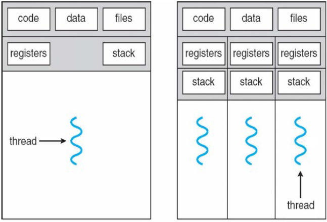
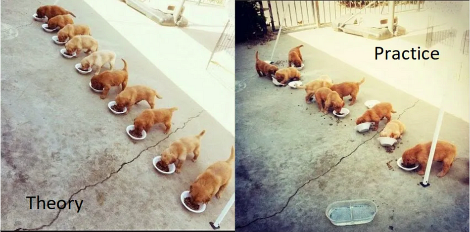
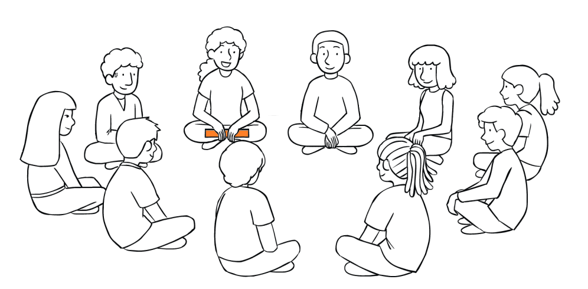
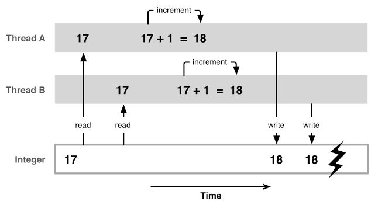

# Dretve

Višedretvenost nam omogućuje postojanje više neovisnih tokova instrukcija koji se unutar jednog procesa mogu izvršavati istovremeno.


U praksi, dretve koristimo kako bismo postigli paralelizam. Primjerice, web preglednik može u jednoj dretvi iscrtavati korisničko sučelje, dok u drugoj preuzima datoteku s interneta. Uređivač teksta može istovremeno obrađivati unos korisnika i provjeravati pravopis.


<div style={{textAlign: 'center'}}>


</div>

## Uvod u višedretvenost

Jedan proces može imati jednu ili više dretvi.
Dretve dijele zajednički adresni prostor, što omogućuje vrlo brzu razmjenu podataka, ali istovremeno zahtijeva pažljivo upravljanje pristupom tim podacima.



| Procesi                                 | Dretve                                       |
|-----------------------------------------|----------------------------------------------|
| *Overhead* kod stvaranja i komunikacije | *Lightweight*                                |
| Izolirani memorijski prostor            | Dijeljeni memorijski prostor                 |
| Neovisni jedni o drugima                | Ovisne jedne o drugima                       |
| Manja potreba za sinkronizacijom        | Sinkronizacija nužna zbog dijeljenih resursa |
| Greške ne utječu na ostale procese      | Greške utječu na ostale dretve               |

### Prednosti korištenja dretvi

Primjena dretvi donosi nekoliko ključnih prednosti u razvoju softvera:

- **Responzivnost:** Čak i ako je jedna dretva blokirana dugotrajnom operacijom, aplikacija može nastaviti reagirati na korisničke zahtjeve putem drugih dretvi.
- **Efikasnost:** Zamjena konteksta između dretvi je znatno brža u usporedbi s procesima.
- **Bolja komunikacija:** Dretve komuniciraju izravno putem dijeljene memorije, što je puno efikasnije od mehanizama koje koriste procesi.
- **Skalabilnost:** Na višeprocesorskim sustavima, dretve omogućuju stvarno paralelno izvršavanje zadataka na različitim jezgrama.

### Izazovi korištenja dretvi

Korištenje dretvi uvodi specifične probleme. Da bismo razumjeli zašto u višedretvenim programima ponekad dolazi do pogrešaka, važno je **razlikovati paralelizam od konkurentnosti**. Paralelizam podrazumijeva stvarno istovremeno izvršavanje zadataka na više procesorskih jezgri, dok konkurentnost označava sposobnost sustava da upravlja s više zadataka koji se preklapaju u vremenu. Čak i na sustavu s jednom jezgrom, OS brzo izmjenjuje dretve, što znači da dretva može biti prekinuta u bilo kojem trenutku (npr. usred matematičke operacije), ostavljajući podatke u nekonzistentnom stanju.



Upravo ta nepredvidivost izvršavanja dovodi do **problema utrkivanja.** Do utrkivanja dolazi kada više dretvi istovremeno pokušava pristupiti i mijenjati zajedničke resurse, pri čemu rezultat ovisi o točnom redoslijedu njihovog izvršavanja koji nije unaprijed definiran. Ovo se najčešće događa u takozvanim **kritičnim sekcijama** koda:

| Operacija           | Primjer                      |
|---------------------|------------------------------|
| *Read-modify-write* | `x = x + 5;`                 |
| *Check-then-act*    | `if (x == 5) { x = x * 2; }` |

Kako bismo spriječili neželjena ponašanja uzrokovana utrkivanjem, koristimo mehanizme **sinkronizacije** kao što su:

- **Atomske operacije:** Operacije koje se izvršavaju kao jedna neraskidiva cjelina.
- **Semafori:** Signalni mehanizmi koji upravljaju pristupom ograničenom broju resursa.
- **Međusobno isključivanje *(mutex):*** Mehanizam zaključavanja koji osigurava da u svakom trenutku samo jedna dretva može biti unutar kritične sekcije. Dok je dretva "vlasnik" *mutex*-a, ostale dretve koje pokušaju ući u istu sekciju bit će blokirane dok se resurs ne oslobodi.

Prije pisanja višedretvenih programa, pažljivo razmotrite maksimalan broj dretvi koje će biti korisne za paralelizaciju zadatka. Ako računalo ima više CPU jezgri, možete koristiti veći broj dretvi, ali nemojte premašiti broj logičkih jezgri. Za provjeru broja logičkih jezgri na računalu koristite funkciju `nproc`, a za detaljnije informacije o CPU naredbu `lscpu`:

```bash
nproc
lscpu
```

## POSIX standard

Operacijski sustavi iz UNIX obitelji prate sučelje za dretve definirano POSIX standardom. Implementacija tog sučelja zove se *POSIX threads* ili `pthreads`. Sučelje za POSIX dretve u programskom jeziku C sadržano je u GNU standardnoj C knjižnici (header `pthread.h`). Prilikom prevođenja C koda, potrebno je dodati zastavicu `-pthread`.

Proučite dokumentaciju vezanu uz POSIX dretve:

```bash
man pthreads
```

### Stvaranje dretvi

Za stvaranje dretvi u programskom jeziku C koristi se funkcija `pthread_create`.

```bash
man pthread_create
```

Funkcija `pthread_create` prima sljedeće argumente:
- `thread`: Pokazivač na varijablu u koju se pohranjuje stvorena dretva
- `attr`: [Atributi](https://docs.oracle.com/cd/E19120-01/open.solaris/816-5137/6mba5vpok/index.html) dretve s pomoću kojih se može prilagoditi ponašanje dretve (veličina stoga, prioritet, politika raspoređivanja itd.)
- `start_routine`: Funkcija koju dretva izvršava
- `arg`: Argumenti koji se prosljeđuju funkciji predanoj pod `start_routine` (funkcionira slično kao `char *argv[]` u potpisu `main` funkcije)

### Čekanje dretvi

Funkcija `pthread_join` također je važna funkcija za rad s dretvama jer ona čeka da se dretva završi prije nego što program nastavi s izvršavanjem glavne dretve. Time se privremeno zaustavlja izvršavanje glavne dretve sve dok druga dretva ne završi, što je posebno korisno kada je potrebno prikupiti rezultate iz više dretvi prije nastavka rada programa.

```bash
man pthread_join
```

Funkcija `pthread_join` prima sljedeće argumente:
- `thread`: Varijabla koja sadrži dretvu koju želimo čekati
- `retval`: Pokazivač na varijablu u koju će se spremiti vrijednost koju dretva vraća. Ako dretvi koja čeka nije bitan rezultat dretve, kao drugi argument funkcije `pthread_join` predaje se `NULL`.

### Završavanje dretvi

Funkcija `pthread_exit` omogućava dretvi da završi svoje izvršavanje i vrati neku vrijednost dretvi koja ju čeka s pomoću `pthread_join`. Tim putem dretva može drugoj dretvi "predati" svoj rezultat.

```bash
man pthread_exit
```

Funkcija `pthread_exit` prima sljedeći argument:
- `retval`: pokazivač na vrijednost koju želimo vratiti. Ako dretva nema vrijednost koju želi vratiti, kao argument funkcije `pthread_exit` predaje se `NULL`.

### Primjer 1

```c title="P01_single-thread.c"
#include <pthread.h>
#include <stdio.h>

#define N_ITERATIONS 1000000

int counter = 0;  // Dijeljena globalna varijabla

void* worker(void* arg) {
    for (int i = 0; i < N_ITERATIONS; i++) {
        counter++;
    }
    pthread_exit(NULL);
}

int main() {
    pthread_t thread;

    // Stvaranje dretve
    pthread_create(&thread, NULL, worker, NULL);

    // Čekanje da dretva završi s izvršavanjem
    pthread_join(thread, NULL);

    printf("Counter is %d\n", counter);
    return 0;
}
```

U ovom slučaju, u funkciju `pthread_create` je za `attr` argument predano `NULL` kako bi se koristili *defaultni* atributi. Argument `arg` je u ovom slučaju `NULL` zato što funkcija `worker` ne prima niti jedan argument, ali inače se može koristiti kako bi dretvama predali dodatne informacije tj. proslijedili parametre u zadatak dretve.

```bash
gcc P01_single-thread.c -o P01_single-thread -pthread && ./P01_single-thread
```

## Zadaci za vježbu
 
U ovim vježbama fokusirat ćemo se na problem utrkivanja i međusobno isključivanje *(mutex)* kao tehniku sinkronizacije koja rješava taj problem.



### Primjer 2: Brojač

U ovom primjeru zadužit ćemo nekoliko dretvi za višestruko inkrementiranje globalnog brojača. Proučite programski kod `P02_race-condition.c`. Uočite:

- Definirane su globalne varijable kojima sve dretve imaju pristup.
- Program kreira dvije dretve i svaku od njih zaduži za inkrementiranje dijeljenog brojača 1000000 puta.
- Kako bi se postigla paralelizacija, važno je pozvati funkciju `pthread_join` u odvojenoj petlji od one u kojoj su dretve pokrenute.

:::info Pitanje
Što očekujete da će se ispisati kada pokrenemo ovaj program?
:::

```bash
gcc P02_race-condition.c -o P02_race-condition -pthread && ./P02_race-condition
```

Razlika u očekivanom i ostvarenom rezultatu događa se zbog toga što se operacija inkrementiranja odvija u tri koraka: učitavanje varijable `counter` u privremeni registar, inkrementiranje registra i konačno ažuriranje varijable `counter`. S obzirom na to da se dretve natječu za iste resurse i nisu dobro usklađene, može doći do problema prilikom mijenjanja vrijednosti:

<div style={{textAlign: 'center'}}>



</div>

Problem utrkivanja u ovom primjeru možemo riješiti korištenjem *mutex*-a. Kada neka dretva dobije pristup resursima oni će se zaključati, što znači da ih ostale dretve neće moći koristiti dok se ne završi rad trenutačne dretve. [Više u dokumentaciji](https://man7.org/linux/man-pages/man3/pthread_mutex_lock.3.html)

Ovo zahtjeva minimalne promjene u kodu. Proučite programski kod `P02_race-condition-lock.c`, uočite razlike i onda pokrenite program.

:::info Pitanje
Što očekujete da će se ispisati kada pokrenemo ovaj program?
:::

```bash
gcc P02_race-condition-lock.c -o P02_race-condition-lock -pthread && ./P02_race-condition-lock
```

Ključne operacije za rad s *mutex* objektima su inicijalizacija (`init`), zaključavanje (`lock`), otključavanje (`unlock`) i uništavanje (`destroy`).

### Zadatak 1: Humanitarna akcija

Pokušajte demonstrirati *mutex* na primjeru bankovnih transakcija kod velike količine transakcija.

Volonterska udruga priprema veliku humanitarnu akciju prikupljanja donacija. Očekuje da će puno zainteresiranih građana htjeti uplatiti donacije i da će puno korisnika udruge htjeti isplatiti prikupljeni novac.

Kako ne bi nastala velika čekanja, sustav je paraleliziran s 10 dretvi, a Vi ste zaduženi za njegovo testiranje. U Vašim testovima (programski kod `Z01_charity.c`), svaka dretva treba obaviti 10 transakcija sa zajedničkom varijablom `total`. U svakoj transakciji, dretva može uplatiti ili isplatiti nasumičnu količinu novca (između -100 i 100$, koristiti [funkciju](https://en.cppreference.com/w/c/numeric/random/rand) `rand()`). Isplata je moguća samo ako ima dovoljno sredstava na računu. Ako transakcija dovodi do negativnog stanja računa, nemojte ažurirati varijablu `total`, nego ispišite poruku i nastavite dalje s izvršavanjem dretve.

```bash
gcc Z01_charity.c -o Z01_charity -pthread && ./Z01_charity
```

Ako uočite da dolazi do utrkivanja i da se stanje na računu ne mijenja na konzistentan način, pokušajte nadopuniti program mehanizmom za zaključavanje resursa.

### Primjer 3: Datoteke

Paralelizacija ubrzava obradu velikog skupa podataka tako što se ti podaci podijele na manje dijelove koji se zatim obrađuju neovisno i istovremeno, svaki u vlastitoj dretvi. Na primjer, kada treniramo model strojnog učenja s velikim brojem slika za treniranje, paralelizacija nam omogućuje da te slike dodijelimo određenom broju dretvi kako bismo istovremeno obradili više slika, svaku u zasebnoj dretvi. Nakon što se sve slike obrade, rezultati se mogu kombinirati kako bi se dobio konačni model.

Proučite programski kod `P03_files.c`. U ovom primjeru želimo obraditi 5 datoteka (na prilično jednostavan način) i dobiti rezultat zajedničke obrade. Koristimo paralelizaciju i obrađujemo jednu datoteku po dretvi.

```bash
gcc P03_files.c -o P03_files -pthread && ./P03_files
```

### Zadatak za kraj

[](https://deadlockempire.github.io/)
