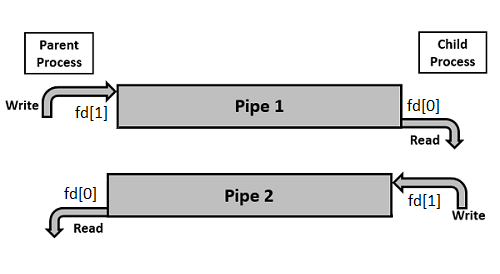

# Cjevovod (Pipe)

import Tabs from "@theme/Tabs";
import TabItem from "@theme/TabItem";

Cjevovod se koristi za jednosmjernu komunikaciju između *parent* i *child* procesa. Ovakav tip komunikacijskog kanala ponekad se naziva *anonymous/unnamed pipe*. Do sada ste se susretali sa cjevovodima u Bash-u kao mehanizmom redirekcije standardnog izlaza jedne naredbe u standardni ulaz druge naredbe, npr.:

```bash
man pipe | head -n 32 | tail -n 10
```
```
    DESCRIPTION
       pipe()  creates  a pipe, a unidirectional data channel that can be used
       for interprocess communication.  The array pipefd is used to return two
       file  descriptors  referring to the ends of the pipe.  pipefd[0] refers
       to the read end of the pipe.  pipefd[1] refers to the write end of  the
       pipe.   Data  written  to  the write end of the pipe is buffered by the
       kernel until it is read from the read end of the pipe.  For further de‐
       tails, see pipe(7).
```

Vođeni ispisom iz dokumentacije, sada ćemo istražiti kako [u kodu](https://en.wikipedia.org/wiki/Pipeline_(Unix)#Creating_pipelines_programmatically) kreirati cjevovod u svrhu međuprocesne komunikacije. Ako želimo postići potpuno dvosmjernu komunikaciju (takvu da oba procesa mogu istovremeno slati i primati podatke), potrebna su **dva cjevovoda**: jedan za slanje podataka u jednom smjeru, a drugi za slanje u drugom smjeru.



<Tabs>
  <TabItem value="c" label="C">

```c title="L09_pipe.c"
#include<stdio.h>
#include<unistd.h>
#include<stdlib.h>
#include<string.h>
#include<sys/wait.h>

int main() {
    // We use two pipes
    // First pipe to send message from parent
    // Second pipe to send message from child

    int fd1[2];  // Used to store two ends of first pipe
    int fd2[2];  // Used to store two ends of second pipe

    if (pipe(fd1) == -1 || pipe(fd2) == -1) {
        fprintf(stderr, "Pipe Failed");
        return 1;
    }

    pid_t forked_pid = fork();

    if (forked_pid < 0) {
        fprintf(stderr, "Fork Failed");
        return 1;
    } else if (forked_pid > 0) {
        // Close reading end of first pipe
        close(fd1[0]);
        // Close writing end of second pipe
        close(fd2[1]);

        // Write message and close writing end of first pipe
        char parent_str[] = "Hello, Child!";
        write(fd1[1], parent_str, strlen(parent_str) + 1);
        close(fd1[1]);

        // Wait for child to terminate
        wait(NULL);

        // Read message from child and close reading end of second pipe
        char result_str[100];
        read(fd2[0], result_str, 100);
        printf("[PARENT %d] Message recieved from child: %s\n", getpid(), result_str);
        close(fd2[0]);
    } else {
        // Close writing end of first pipe
        close(fd1[1]);
        // Close reading end of second pipe
        close(fd2[0]);

        // Read message from parent and close reading end of first pipe
        char result_str[100];
        read(fd1[0], result_str, 100);
        printf("[CHILD %d] Message recieved from parent: %s\n", getpid(), result_str);
        close(fd1[0]);

        // Create a concatenated string
        char child_str[] = " Hope you are well.";
        strcat(result_str, child_str);

        // Write message and close writing end of second pipe
        write(fd2[1], result_str, strlen(result_str) + 1);
        close(fd2[1]);

        // Send SIGCHLD signal
        exit(0);
    }
}
```
```bash
gcc L09_pipe.c -o L09_pipe && ./L09_pipe
```
  </TabItem>
  <TabItem value="python" label="Python predložak">

```python title="L09_pipe.py"
import os

read1, write1 = os.pipe()  # Message from parent to child
read2, write2 = os.pipe()  # Message from child to parent

forked_pid = os.fork()

if forked_pid > 0:
    # Close reading end of first pipe
    # ...
    # Close writing end of second pipe
    # ...

    parent_str = "Hello, Child!"
    # Encode the parent string into a byte array and write message to first pipe
    # ...
    # Close writing end of first pipe
    # ...

    # Wait for child to terminate
    os.wait()

    # Read message from child (100 bytes) and decode the byte array to string
    # result_str = ...
    print(f"[PARENT {os.getpid()}] Message recieved from child: {result_str}")
    # Close reading end of second pipe
    # ...
else:
    # Close writing end of first pipe
    # ...
    # Close reading end of second pipe
    # ...

    # Read message from parent (100 bytes) and decode the byte array to string
    # result_str = ...
    print(f"[CHILD {os.getpid()}] Message recieved from parent: {result_str}")
    # Close reading end of first pipe
    # ...

    # Create a concatenated string
    child_str = " Hope you are well."
    result_str += child_str

    # Encode the result string into a byte array and write message to second pipe
    # ...
    # Close writing end of second pipe
    # ...

    # Send SIGCHLD signal
    os._exit(os.EX_OK)
```
```bash
python3 L09_pipe.py
```
  </TabItem>
</Tabs>

