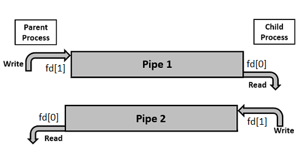

# Cjevovod (Pipe)

Cjevovod se koristi za jednosmjernu komunikaciju između *parent* i *child* procesa. Ovakav tip komunikacijskog kanala ponekad se naziva *anonymous/unnamed pipe*. Do sada ste se susretali sa cjevovodima u Bashu kao mehanizmom redirekcije standardnog izlaza jedne naredbe u standardni ulaz druge naredbe, npr.:

```bash
man pipe | head -n 32 | tail -n 10
```
```
DESCRIPTION
    pipe()  creates  a pipe, a unidirectional data channel that can be used
    for interprocess communication.  The array pipefd is used to return two
    file  descriptors  referring to the ends of the pipe.  pipefd[0] refers
    to the read end of the pipe.  pipefd[1] refers to the write end of  the
    pipe.   Data  written  to  the write end of the pipe is buffered by the
    kernel until it is read from the read end of the pipe.  For further de‐
    tails, see pipe(7).
```

## Primjer 3: Cjevovod

Vođeni ispisom iz dokumentacije, sada ćemo istražiti kako [u kodu](https://en.wikipedia.org/wiki/Pipeline_(Unix)#Creating_pipelines_programmatically) kreirati cjevovod u svrhu međuprocesne komunikacije. Ako želimo postići potpuno dvosmjernu komunikaciju (takvu da oba procesa mogu istovremeno slati i primati podatke), potrebna su **dva cjevovoda**: jedan za slanje podataka u jednom smjeru, a drugi za slanje u drugom smjeru.

<div style={{textAlign: 'center'}}>



</div>

```c title="P03_pipe.c"
#include <stdio.h>
#include <stdlib.h>
#include <string.h>
#include <sys/wait.h>
#include <unistd.h>

int main() {
    // Koristimo dva cjevovoda
    // Prvi cjevovod za slanje poruke od roditelja do djeteta
    // Drugi cjevovod za slanje poruke od djeteta do roditelja

    int fd1[2];  // Dva kraja prvog cjevovoda
    int fd2[2];  // Dva kraja drugog cjevovoda

    if (pipe(fd1) == -1 || pipe(fd2) == -1) {
        perror("Pipe Failed");
        return 1;
    }

    pid_t forked_pid = fork();

    if (forked_pid < 0) {
        perror("Fork Failed");
        return 1;
    } else if (forked_pid > 0) {
        // Zatvaranje dijela za čitanje prvog cjevovoda
        close(fd1[0]);
        // Zatvaranje dijela za pisanje drugog cjevovoda
        close(fd2[1]);

        // Zapisivanje poruke i zatvaranje dijela za pisanje prvog cjevovoda
        char parent_str[] = "Hello, Child!";
        write(fd1[1], parent_str, strlen(parent_str) + 1);
        close(fd1[1]);

        // Čekanje da dijete završi
        wait(NULL);

        // Čitanje poruke od djeteta i zatvaranje dijela za čitanje drugog
        // cjevovoda
        char result_str[100];
        read(fd2[0], result_str, 100);
        printf("[PARENT %d] Message recieved from child: %s\n", getpid(),
               result_str);
        close(fd2[0]);
    } else {
        // Zatvaranje dijela za pisanje prvog cjevovoda
        close(fd1[1]);
        // Zatvaranje dijela za čitanje drugog cjevovoda
        close(fd2[0]);

        // Čitanje poruke od roditelja i zatvaranje dijela za čitanje prvog
        // cjevovoda
        char result_str[100];
        read(fd1[0], result_str, 100);
        printf("[CHILD %d] Message recieved from parent: %s\n", getpid(),
               result_str);
        close(fd1[0]);

        // Modifikacija poruke (dodavanje teksta)
        char child_str[] = " Hope you are well.";
        strcat(result_str, child_str);

        // Zapisivanje poruke i zatvaranje dijela za pisanje drugog cjevovoda
        write(fd2[1], result_str, strlen(result_str) + 1);
        close(fd2[1]);

        // Dijete završava, a roditelj će dobiti SIGCHLD signal
        exit(0);
    }

    return 0;
}
```
```bash
gcc P03_pipe.c -o P03_pipe && ./P03_pipe
```

