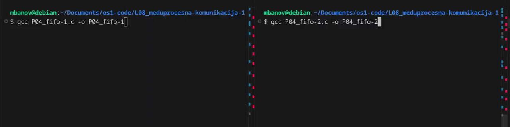

# Imenovani cjevovod (Named pipe, FIFO)

import Tabs from "@theme/Tabs";
import TabItem from "@theme/TabItem";

Imenovani cjevovod je [sličan](https://www.sfu.ca/sasdoc/sashtml/os2/zipeover.htm) prethodno navedenoj tehnici, uz neke dodatne mogućnosti. Uobičajeno nazivlje za ovakav tip komunikacijskog kanala je *named pipe/FIFO*.

Inicijalizacijom imenovanog cjevovoda stvara se referenca u datotečnom sustavu. Ta je referenca dostupna svim procesima, ali se najčešće koristi između dva nepovezana procesa. FIFO omogućava dvosmjernu komunikaciju, za što je dovoljna samo jedna instanca (za razliku od prethodno opisanog cjevovoda). Važno je naglasiti da vrijedi pravilo "prvi unutra, prvi van" *(first-in-first-out)*. Iako se više procesa može povezati na FIFO, samo jedan proces može čitati trenutačno pohranjenu poruku. Nakon toga ona nestaje iz FIFO reda.

## Primjer 4: Imenovani cjevovod

Zanimljiv primjer primjene ovog koncepta opisan je [ovdje](https://en.wikipedia.org/wiki/Named_pipe#In_Unix). U zadanom primjeru dva procesa koriste isti imenovani cjevovod kako bi čitali i pisali u njega:

<Tabs>
  <TabItem value="c" label="C">

```bash
gcc P04_fifo-1.c -o P04_fifo-1
gcc P04_fifo-2.c -o P04_fifo-2
```
  </TabItem>
  <TabItem value="python" label="Python">

```bash
python3 P04_fifo-1.py
python3 P04_fifo-2.py
```
  </TabItem>
</Tabs>

Pokrenite ova dva programa u dva različita terminala. Naizmjence šaljite poruke kroz cjevovod.

<div style={{width: "1280"}}>



</div>

:::info Pitanje
Zašto prvi program ne ispisuje ništa sve dok se ne pokrene drugi program? [HINT](https://www.cs.kent.edu/~ruttan/sysprog/lectures/shmem/pipes#named_pipe_read_write)
:::
