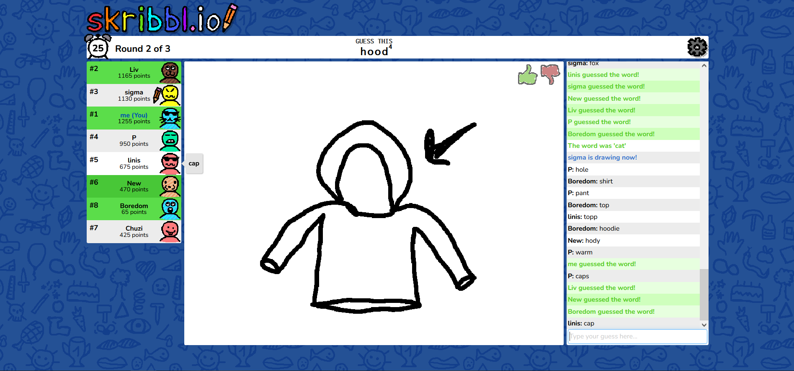

# Utičnice (Sockets)

import Tabs from "@theme/Tabs"
import TabItem from "@theme/TabItem"

## Konfiguracija utičnice

Stil komunikacije određuje na koji način *socket* tretira prenesene podatke. Ovdje razlikujemo dva osnovna tipa:
- **Stream sockets:** Pružaju pouzdanu vezu sličnu TCP protokolu. Sustav garantira da će svi paketi stići do odredišta u točnom redoslijedu kojim su poslani. Ako se neki paket izgubi, automatski se ponovno šalje.
- **Datagram sockets:** Fokusirani su na brzinu i slični su UDP protokolu. Veza je nepouzdana jer nema garancije isporuke niti redoslijeda, što je korisno u aplikacijama gdje je niska latencija važnija od potpune preciznosti.

*Namespace* definira format adrese utičnice, odnosno način na koji identificiramo jedan kraj veze.
- U lokalnoj komunikaciji na istom računalu koristimo putanju unutar datotečnog sustava *(file descriptor).*
- U mrežnoj komunikaciji koristimo kombinaciju IP adrese hosta i broja porta.

Protokol je skup pravila za slanje podataka. Iako postoje specifični protokoli poput AppleTalk-a ili UNIX lokalnih protokola, najčešće se oslanjamo na TCP/IP ili UDP.

U praksi je najbolje koristiti zadane postavke jer kombinacija stila i *namespacea* obično implicira najpogodniji protokol, kao što ćemo vidjeti u današnjim vježbama. Bavit ćemo se mrežnim utičnicama koje koriste TCP protokol i komunikaciju putem toka podataka *(stream sockets + Internet namespace + TCP protocol)*. 

## Životni ciklus i sistemski pozivi

Rad s utičnicama oslanja se na niz sistemskih poziva koji upravljaju njihovim životnim ciklusom. Proces započinje pozivom `socket` kojim stvaramo samu utičnicu. Na poslužiteljskoj strani, koristimo `bind` kako bismo utičnicu povezali s određenom adresom i portom, nakon čega `listen` stavlja utičnicu u stanje pripravnosti za dolazne veze. Kada klijent pokrene `connect` zahtjev, poslužitelj ga prihvaća naredbom `accept`, koja zapravo stvara novu utičnicu namijenjenu isključivo toj specifičnoj vezi. Razmjena podataka vrši se pozivima `send` i `recv`, a po završetku komunikacije, resurse oslobađamo pozivom `close`.

Najčešći oblik upotrebe utičnica je u komunikaciji između poslužitelja i klijenta gdje poslužiteljska strana čeka na uspostavu veze od strane klijenta.


Stanje utičnica na računalu možete provjeriti uz pomoć alata `netstat`:

```bash
sudo apt install net-tools
netstat -an
```

Stanje TCP utičnica na računalu možete provjeriti ovako:

```bash
netstat -tn
```

### Primjer 1: Hello, world

<Tabs>
  <TabItem value="c" label="C">

Poslužitelj i klijent razmjenjuju jednu poruku. Za svaku stranu (program) pišemo jedan kod. Koristimo `unistd` knjižnicu koja sadrži *wrappere* za sistemski poziv `close`. Knjižnicu `arpa/inet.h` koristimo za funkcije vezane uz mrežnu komunikaciju (npr. `htons`, `inet_addr`, itd.) Utičnice i funkcije za rad sa utičnicama su definirane u `sys/socket.h`. Struktura `sockaddr_in` je definirana u `netinet/in.h`.

Možete definirati port koji želite da klijent koristi prilikom poziva `bind` funkciji (morate koristiti `htons` funkciju prilikom definiranja porta).

Otvorite dva terminala i pokrenite sljedeće naredbe:

```bash
gcc P01_server.c -o P01_server && ./P01_server
```

```bash
gcc P01_client.c -o P01_client && ./P01_client
```

  </TabItem>
  <TabItem value="python" label="Python">
Poslužitelj i klijent razmjenjuju jednu poruku. Za svaku stranu (program) pišemo jedan kod. Koristimo Python knjižnicu za rad s utičnicama, [socket](https://docs.python.org/3/library/socket.html).

Otvorite dva terminala i pokrenite sljedeće naredbe:

```bash
python3 P01_server.py
```

```bash
python3 P01_client.py
```
  </TabItem>
</Tabs>

### Zadatak 1: Vješala

Poslužiteljski dio aplikacije u pravilu sadrži većinu logike, prati trenutačno stanje i komunicira s klijentima. U primjeru igre Vješala, poslužitelj nasumično odabire tajnu riječ i reagira na korisnikove pokušaje. Pritom prati koliko je pokušaja preostalo do kraja igre i šalje klijentu sve potrebne informacije.

<Tabs>
  <TabItem value="c" label="C">

Nadopunite kod za poslužitelja i omogućite povezivanje s klijentom putem utičnica. Logika igre već je implementirana. Nakon toga otvorite terminal i pokrenite:

```bash
gcc Z01_game_server.c -o Z01_game_server && ./Z01_game_server
```

Klijentski dio aplikacije predstavlja sučelje prema korisniku koje mu omogućuje sudjelovanje u igri. Nadopunite kod za klijenta i omogućite povezivanje s poslužiteljom putem utičnica. Nakon toga u drugom terminalu pokrenite:

```bash
gcc Z01_game_client.c -o Z01_game_client && ./Z01_game_client
```

Odigrajte rundu Vješala. **Dozvoljen je unos jednog slova.**

  </TabItem>
  <TabItem value="python" label="Python">

Kako biste mogli pokrenuti i testirati vaš kod, instalirajte paket za generiranje slučajnih riječi na engleskom jeziku:

```bash
pip install wonderwords
```

Nadopunite kod za poslužitelja i omogućite povezivanje s klijentom putem utičnica. Logika igre već je implementirana. Nakon toga otvorite terminal i pokrenite:

```bash
python3 Z01_game_server.py
```

Klijentski dio aplikacije predstavlja sučelje prema korisniku koje mu omogućuje sudjelovanje u igri. Nadopunite kod za klijenta i omogućite povezivanje s poslužiteljom putem utičnica. Nakon toga u terminalu pokrenite:

```bash
python3 Z01_game_client.py
```

Odigrajte rundu Vješala. **Dozvoljen je unos jednog slova ili cijele riječi.**

  </TabItem>
</Tabs>

Ovakva podjela i razdvajanje logike igre od korisničkog sučelja, uz korištenje utičnica za komunikaciju između poslužitelja i klijenata omogućuje efikasnu interakciju i fleksibilan razvoj:
- Možda ćemo jednog dana htjeti izgraditi grafičko sučelje za igru umjesto tekstualnog sučelja. Tada ćemo mijenjati samo klijentski dio aplikacije, a poslužiteljsku logiku ne moramo mijenjati.
- Možemo mijenjati parametre igre (maksimalan broj pokušaja, raspon duljine nasumičnih riječi) na poslužitelju, bez utjecaja na klijenta.

:::info Napomena
Ako budete htjeli više puta isprobati igru, morat ćete sačekati između pokušaja da operacijski sustav oslobodi port koji koristite za komunikaciju. Čak i nakon uspješnog zatvaranja socketa, taj port može ostati u `TIME_WAIT` statusu neko vrijeme. Budite strpljivi i **uvijek prvo pokrećite poslužitelja, a tek onda klijenta**.
:::

### Primjer 2: Višestruke veze

Do sada smo radili sa slučajem u kojem se na jednog poslužitelja spaja točno jedan klijent. Korištenjem utičnica možemo omogućiti da više klijenata pristupa istom poslužitelju i tako postići interakciju među korisnicima. U ovom primjeru izgradit ćemo chat aplikaciju kako bismo demonstrirali rad s višestrukim vezama. Dodavanje te funkcionalnosti učinit će naš kod malo kompleksnijim.

S poslužiteljske strane, osim inicijalizacije veze, logike aplikacije i zatvaranja veze, moramo dodati još jednu zadaću: upravljanje višestrukim vezama. To ujedno postaje i **glavna zadaća** našeg servera, što znači da se logika aplikacije seli u odvojenu dretvu i to na način da se ona preslikava na svakog spojenog klijenta (jedan klijent = jedna dretva, funkcija `client_thread`). Klijente koji su se spojili na server pratimo u listi `clients`. Kada klijent želi prekinuti komunikaciju, **mičemo ga iz liste**. Također, dodajemo mogućnost da se poruka koju je poslao jedan klijent emitira svim ostalim spojenim klijentima (funkcija `broadcast`). Naš server omogućava da se više klijenata uključi u chat, ali se "gasi" u trenutku kada svi klijenti označe kraj komunikacije, odnosno kada je lista `clients` prazna.

<Tabs>
  <TabItem value="c" label="C">

:::info Napomena
U idućim kodovima su neke od prethodno pokazanih provjera preskočene kako se kod ne bi dodatno zakomplicirao.
:::

```bash
gcc -pthread P02_multi_server.c -o P02_multi_server && ./P02_multi_server
```
  </TabItem>
  <TabItem value="python" label="Python">

```bash
python3 P02_multi_server.py
```
  </TabItem>
</Tabs>

Kod za klijenta je isto postao malo kompleksniji. U prethodnim slučajevima, komunikacija između klijenta i servera je bila slijedna jer je klijent očekivao poruku od servera tek kao **odgovor** na poruku koju bi mu sam poslao. U chat aplikaciji svi korisnici mogu slati poruke nedefiniranim redoslijedom. To znači da klijent mora istovremeno pratiti dva izvora podataka: standardni ulaz ako trenutačni korisnik želi poslati neku poruku i vezu sa server socketom ako želi proslijediti poruke od ostalih klijenata. Te dvije zadaće mogle bi se odvojiti i u dvije dretve, ali ovdje ćemo koristiti malo stariji mehanizam, funkciju `select`.

Pokrenite sljedeću naredbu u dva različita terminala i isprobajte chat funkcionalnost.
Kada želite završiti s komunikacijom, pritisnite `Enter`.

<Tabs>
  <TabItem value="c" label="C">

```bash
gcc -pthread P02_multi_client.c -o P02_multi_client && ./P02_multi_client
```

:::info Pitanje
Primjećujete li neki problem u serverskom kodu iz perspektive višedretvenosti?
:::

  </TabItem>
  <TabItem value="python" label="Python">

```bash
python3 P02_multi_client.py
```
  </TabItem>
</Tabs>

### Zadatak 2: Višestruka Vješala

Probajte nadopuniti kod iz Zadatka 1 prateći Primjer 2 kako biste omogućili da više klijenata istovremeno igraju Vješala i zajedno pogađaju tajnu riječ.

### Zadatak za kraj

[](https://skribbl.io/)
