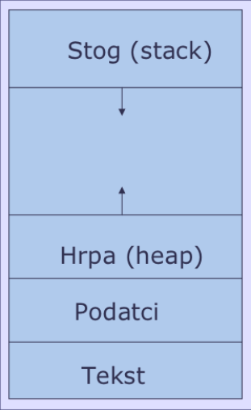
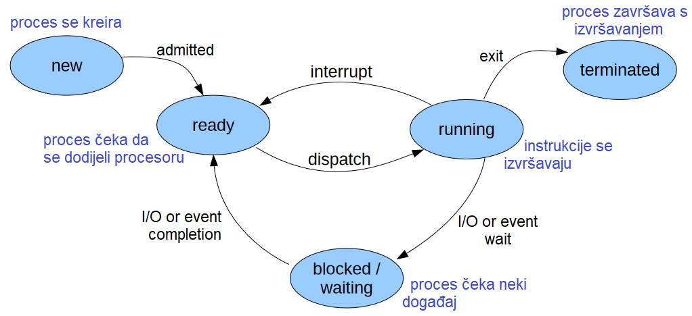
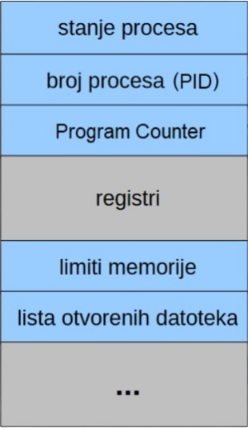

# Procesi 1

## Što su procesi?

Proces je instanca računalnog programa u izvođenju. Kako bi proces mogao obavljati svoje zadatke, OS mu mora dodijeliti određene resurse, prvenstveno procesorsko vrijeme (CPU), radnu memoriju, pristup datotekama te ulazno-izlazne (I/O) uređaje.

:::info Napomena
Dok je program statični skup instrukcija pohranjen na disku, proces je aktivna jedinica koja se izvršava u memoriji.
:::

Procesi su međusobno nezavisni. Čak i u situacijama kada više procesa pokreće isti program (primjerice, dva otvorena prozora istog preglednika), svaki od njih koristi vlastite, zasebne resurse i ima izoliran memorijski prostor.

OS brine o kreiranju i brisanju procesa, njihovom raspoređivanju *(scheduling)* te osigurava mehanizme za komunikaciju, sinkronizaciju i rješavanje zastoja.

### Struktura procesa u memoriji

Kada se program učita u memoriju i postane proces, njegov memorijski prostor podijeljen je u sljedeće segmente:

- **Stog:** Privremeni podaci kao što su parametri funkcija, povratne adrese i lokalne varijable.
- **Hrpa:** Dio memorije koji se dinamički alocira tijekom rada programa (npr. korištenjem funkcije `malloc` u C-u).
- **Podatkovni dio:** Globalne i statičke varijable.
- **Tekstualni dio:** Strojni kod programa koji proces izvršava.


<div style={{textAlign: 'center'}}>



</div>


### Stanja procesa

Tijekom svog životnog ciklusa, proces prolazi kroz različita stanja. Razumijevanje ovih stanja ključno je za shvaćanje kako OS raspoređuje procese i postiže paralelizam:



### Process Control Block (PCB)

Za svaki proces, OS održava posebnu strukturu podataka nazvanu *Process Control Block (PCB)* koja sadrži sve informacije potrebne za njegovo upravljanje:

<div style={{textAlign: 'center'}}>



</div>

### Hijerarhija procesa

U operacijskom sustavu Linux, procesi su organizirani u strogu hijerarhijsku strukturu nalik stablu. Iako je Linux višeprocesni sustav, on direktno pokreće samo `init` proces (`PID=1`). To je prvi proces koji se pokreće pri podizanju sustava i stalno je u stanju izvršavanja *(running).*

Svi ostali procesi na sustavu nastaju kao djeca postojećih procesa. Svaki proces ima točno jednog roditelja. Proces može imati puno braće i sestara *(siblings).* *Siblings* procesi su stvoreni od istog roditelja.
Djeca mogu stvarati djecu. itd...

## Pregled procesa

- `ps` - daje informacije o procesima koji se trenutno izvršavaju, uključujući i njihov jedinstveni identifikacijski broj (PID)
- `pgrep` - pretraga procesa po imenu
- `pidof` - ispis `PID`-ova procesa s određenim imenom
- `pstree` - prikaz stabla procesa
- `top` - prikazuje i ažurira sortirane informacije o Linux procesima
- `htop` - interaktivni preglednik procesa
- `atop` - [Advanced System and Process Monitor](https://atoptool.nl/)

```bash
ps
```

Detaljnije informacije možemo dobiti sa `-f`:

```bash
ps -f
```

Ako nas zanima proces s poznatim PID-om, možemo ga provjeriti sa `-p`:

```bash
ps -fp 1  # ps -f -p 1
```

Naredba `ps` obično prikazuje samo procese povezane s trenutačnom ljuskom/sesijom. To znači da će se unutar terminala prikazati samo oni procesi koji se odnose na njegovo izvršavanje. Ako želimo vidjeti sve procese koji se izvode na sustavu, možemo koristiti `-e`:

```bash
ps -fe  # ps -f -e
```

Možemo filtrirati procese po određenom korisniku:

```bash
ps -fu $USER  # ps -f -u $USER
```

Ako želimo filtrirati procese po imenu, možemo koristiti `grep`:

```bash
ps -e | grep firefox
```

Jednostavnije je koristiti `pgrep`:

```bash
pgrep firefox
```

Ako nas zanima PID procesa kojem poznajemo ime, možemo koristiti `pidof`:

```bash
pidof firefox-esr
```

Grafički prikaz roditelja i djece procesa možemo vidjeti sa `pstree`:

```bash
pstree
```

- Napišite naredbu kojom ćete prikazati sve procese koje je pokrenuo korisnik `root`, uz detaljne informacije
- Isprobajte osnovno korištenje naredbi `top` i `htop` (interaktivni preglednici procesa)

### Primjer 1

Ovako dohvaćamo PID trenutačnog procesa:

```c title="P01_print-pid.c"
#include <stdio.h>
#include <unistd.h>

int main() {
    printf("Process ID: %d\n", getpid());
    return 0;
}
```
```bash
gcc P01_print-pid.c -o P01_print-pid && ./P01_print-pid
```


### Primjer 2

Zadana je funkcija koja računa kvadrat unesenog broja i ispisuje PID trenutačnog procesa. Kreirajte listu od 10 brojeva i pozovite funkciju `square` nad svim elementima te liste:

```c title="P02_square.c"
#include <stdio.h>
#include <unistd.h>

int square(int num) {
    printf("Uneseni broj: %d, PID procesa: %d\n", num, getpid());
    return num * num;
}

int main() {
    // TODO: Kreirajte listu od 10 brojeva i pozovite funkciju `square`
    // nad svim elementima te liste

    return 0;
}
```
```bash
gcc P02_square.c -o P02_square && ./P02_square
```


Ispišite detaljne informacije o procesu s tim PID-om.

## Terminiranje procesa

- `kill` - terminira proces s poznatim PID-om
- `killall` - terminira procese s poznatim imenom

Ove naredbe po *default*-u procesima šalju signal `SIGTERM (15)` kako bi se procesi normalno završili. Korisnik može procesima poslati i [drugačije signale](https://faculty.cs.niu.edu/~hutchins/csci480/signals.htm), poput `SIGKILL (9)` za trenutačan prekid procesa.

### Primjer 3

Iskoristimo prethodni primjer i napravimo ga da se vječno izvršava:

```c title="P03_infinite-square.c"
#include <stdio.h>
#include <unistd.h>

int square(int num) {
    printf("Uneseni broj: %d, PID procesa: %d\n", num, getpid());
    return num * num;
}

int main() {
    // TODO: Proširite prethodni primjer da se beskonačno izvršava

    return 0;
}
```

Pokrenimo ovaj beskonačni C proces u novom terminalu:

```bash
gcc P03_infinite-square.c -o P03_infinite-square && ./P03_infinite-square
```

Pronađimo proces u popisu:

```bash
ps -fu $USER
```

Uništimo novokreirani proces naredbom `kill`:

```bash
kill ...
```

Provjerimo je li proces eliminiran:

```bash
ps -fu $USER
```

Sada ćemo napisati program koji ubija procese. Ponovno pokrenite beskonačni program u terminalu.
Pohranite novi PID kao [varijablu okruženja](https://www.linuxbash.sh/post/working-with-environment-variables-in-bash):

```bash
export VICTIM_PID=...
```

:::info Pitanje
Kako biste provjerili je li varijabla okruženja `VICTIM_PID` točno zapisana?
:::

```c title="P03_murderer.c"
#include <stdio.h>
#include <stdlib.h>
#include <unistd.h>
#include <signal.h>

int main() {
    char* victim_pid_str = getenv("VICTIM_PID");
    if (!victim_pid_str) {
        perror("Varijabla okruženja VICTIM_PID nije postavljena");
        return 1;
    }

    pid_t victim_pid = (pid_t) atoi(victim_pid_str);
    printf("My pid is %d\n", getpid());
    kill(victim_pid, SIGTERM);
    return 0;
}
```
```bash
gcc P03_murderer.c -o P03_murderer
```

Alat `strace` koji smo do sada koristili za praćenje sistemskih poziva u ovoj ćemo vježbi koristiti za praćenje signala koje procesi primaju. Želimo utvrditi kako će se terminirati naš beskonačni proces. Kopirajte sljedeću naredbu u terminal i **obavezno zamijenite `...` s PID-om procesa žrtve.** Naredbe koje završavaju sa znakom `&` pokreću se u pozadini. Ova `strace` naredba ignorira sve sistemske pozive procesa žrtve i bilježi samo signale koje taj proces prima u datoteku nazvanu `P03_victim-strace.out`.

```bash
strace -tt -o P03_victim-strace.out -p ... -e "trace=all" &
ps -fu $USER
```

Ubijmo žrtvu i promotrimo signale koje vraća `strace`:

```bash
strace -tt -e "trace=all" ./P03_murderer
ps -fu $USER
cat P03_victim-strace.out
```

## Siročad *(orphans)*

Pokrenimo jedan jednostavni proces u pozadini. Želimo da se naš proces nastavlja izvršavati čak i ako ugasimo terminal (efektivno ubijemo roditeljski proces). To možemo uz pomoć naredbe `nohup`. Kopirajte sljedeću naredbu u terminal:

```bash
nohup sleep 120 &
```

Pronađite proces:

```bash
ps -fu $USER
```

Zatvorite terminal u kojem ste pokrenuli pozadinski proces (roditeljski proces). Možete li još uvijek pronaći proces `sleep`? 

```bash
ps -fe | grep sleep
```

Je li došlo do promjene u popisu procesa? Što je novi roditeljski proces?

```bash
ps -fp ...
```

Nakon terminiranja roditeljskog procesa, naš pozadinski proces je postao siroče *(orphaned process)*. Tada ga je preuzeo OS kako bi se uspješno nastavilo njegovo izvršavanje do kraja.
