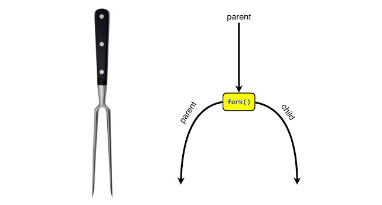

# Procesi 2

import Tabs from "@theme/Tabs";
import TabItem from "@theme/TabItem";

Jezgra pokreće `init` proces pri pokretanju sustava, a taj proces onda naknadno stvara sve ostale procese. Tako nastaje hijerarhijska struktura slična (obiteljskom) stablu, gdje svaki proces ima jednog roditelja i može imati više djece.

## Kreiranje procesa

Jedan proces može stvoriti nove procese sistemskim pozivom `fork`, pri čemu su novonastali procesi **kopije** (klonovi) roditeljskog procesa. *Children* procesi kopiraju (nasljeđuju) trenutno stanje memorije *parent* procesa, ali se izvršavaju nezavisno.

Isječak iz službene dokumentacije:  
`man fork | head -n 20 | tail -n 10 && man fork | head -n 115 | tail -`

```
    DESCRIPTION
        fork()  creates  a new process by duplicating the calling process.  The
        new process is referred to as the child process.  The  calling  process
        is referred to as the parent process.

         The child process and the parent process run in separate memory spaces.
         At the time of fork() both memory spaces have the same content.  Memory
         writes,  file  mappings (mmap(2)), and unmappings (munmap(2)) performed
         by one of the processes do not affect the other.

    RETURN VALUE
        On success, the PID of the child process is returned in the parent, and
        0  is returned in the child.  On failure, -1 is returned in the parent,
        no child process is created, and errno is set appropriately
```



## Primjer 1: Hello, World

<Tabs>
  <TabItem value="c" label="C">

```c title="L07_hello_world.c"
#include <unistd.h>
#include <stdio.h>

int main() {
    printf("Current process PID=%d", getpid());

    pid_t forked_pid = fork();
    
    printf("\nDid a fork. It returned %d.\n └─ PID = %d, PPID = %d\n", 
           forked_pid, getpid(), getppid());

    return 0;
}
```
```bash
gcc L07_hello_world.c -o L07_hello_world && ./L07_hello_world
```
  </TabItem>
  <TabItem value="python" label="Python">

```python title="L07_hello_world.py"
import os

print(f"Current process PID={os.getpid()}")
forked_pid = os.fork()
print(f"Did a fork. It returned {forked_pid}.\n └─ PID = {os.getpid()}, PPID = {os.getppid()}")
```
```bash
python3 L07_hello_world.py
```
  </TabItem>
</Tabs>

**Pitanja:**

- Koji je PID *child* procesa?
- Zašto ne dolazi do beskonačnog kreiranja novih procesa?
- Zašto se poruka `Current process PID=...` ispisala dva puta?

<Tabs>
  <TabItem value="c" label="C">

```c title="L07_hello_world_flush.c"
#include <unistd.h>
#include <stdio.h>

int main() {
    printf("Current process PID=%d", getpid());
    fflush(stdout);

    pid_t forked_pid = fork();
    
    printf("\nDid a fork. It returned %d.\n └─ PID = %d, PPID = %d\n", 
           forked_pid, getpid(), getppid());

    return 0;
}
```
```bash
gcc L07_hello_world_flush.c -o L07_hello_world_flush && ./L07_hello_world_flush
```

Kada koristite funkciju `printf()`, C ne ispisuje odmah zadani string, već ga prvo nakratko pohranjuje u privremenu memoriju (međuspremnik). Kada koristite `fork()` za stvaranje novog procesa, *child* proces nasljeđuje međuspremnik od *parent* procesa. Dodavanjem naredbe `fflush(stdout)` prisiljavate C da odmah [ispiše sadržaj međuspremnika i isprazni ga ](https://en.cppreference.com/w/c/io/fflush). Time ujedno i osiguravate da *child* proces naslijedi prazan međuspremnik i izbjegavate moguće *bug*-ove poput dupliciranog ispisa.
  </TabItem>
  <TabItem value="python" label="Python">

```python title="L07_hello_world_flush.py"
import os

# Odmah isprazni međuspremnik
print(f"Current process PID={os.getpid()}", flush=True)
forked_pid = os.fork()
print(f"Did a fork. It returned {forked_pid}.\n └─ PID = {os.getpid()}, PPID = {os.getppid()}")
```
```bash
python3 L07_hello_world_flush.py
```

Kada koristite funkciju `print()`, Python ne ispisuje odmah zadani string, već ga prvo nakratko pohranjuje u privremenu memoriju (međuspremnik). Kada koristite `os.fork()` za stvaranje novog procesa, *child* proces nasljeđuje međuspremnik od *parent* procesa. Dodavanjem `flush=True` funkciji `print()` prisiljavate Python da odmah ispiše string i [isprazni međuspremnik](https://docs.python.org/3/library/functions.html#print). Time ujedno i osiguravate da *child* proces naslijedi prazan međuspremnik i izbjegavate moguće *bug*-ove poput dupliciranog ispisa.
  </TabItem>
</Tabs>

<Tabs>
  <TabItem value="c" label="C">

```c title="L07_hello_world_sleep.c"
#include <unistd.h>
#include <stdio.h>

int main() {
    pid_t forked_pid = fork();
    // Roditelj ce zavrsiti odmah, a dijete ce prvo cekati nekoliko sekundi
    // te zatim ispisati poruku i zavrsiti
    if (forked_pid == 0) {
        sleep(5);
        printf("Hello world\n");
    }
    return 0;
}
```
```bash
gcc L07_hello_world_sleep.c -o L07_hello_world_sleep && ./L07_hello_world_sleep
```
  </TabItem>
  <TabItem value="python" label="Python">

```python title="L07_hello_world_sleep.py"

```
  </TabItem>
</Tabs>

## Primjer 2: Odnos djeteta i roditelja

U ovom se primjeru *child* proces izvršava neko dulje vrijeme i pri uspješnom izvršavanju šalje roditelju `SIGCHLD` signal koristeći funkciju `_exit()`. *Parent* proces čeka na *child* proces.

<Tabs>
  <TabItem value="c" label="C">

```c title="L07_parent_child.c"
#include <stdio.h>
#include <unistd.h>     // fork, getpid, sleep, _exit
#include <stdlib.h>     // EXIT_SUCCESS
#include <sys/wait.h>   // wait

int main() {
    printf("[PARENT] Current PID: %d\n", getpid());
    fflush(stdout);

    pid_t forked_pid = fork();

    if (forked_pid == 0) {
        printf("[CHILD ] Fork returned %d, current PID %d\n", forked_pid, getpid());
        sleep(5);
        printf("[CHILD ] Child ends.\n");
        _exit(EXIT_SUCCESS);
    } else if (forked_pid > 0) {
        printf("[PARENT] Fork returned %d, current PID: %d\n", forked_pid, getpid());
        printf("[PARENT] Waiting for child ..................\n");
        int status;
        pid_t child_pid = wait(&status);
        printf("[PARENT] Child with PID = %d finished with return value %d\n", child_pid, status);
    } else {
        printf("[PARENT] Fork failed\n");
        return 1;
    }

    return 0;
}
```
```bash
gcc L07_parent_child.c -o L07_parent_child && ./L07_parent_child
```
  </TabItem>
  <TabItem value="python" label="Python">

```python title="L07_parent_child.py"
import os
import time

print(f"[PARENT] Current PID: {os.getpid()}", flush=True)

forked_pid = os.fork()

if forked_pid == 0:
    print(f"[CHILD ] Fork returned {forked_pid}, current PID {os.getpid()}")
    time.sleep(5)
    print(f"[CHILD ] Child ends.")
    os._exit(os.EX_OK)
else:
    print(f"[PARENT] Fork returned {forked_pid}, current PID: {os.getpid()}")
    print(f"[PARENT] Waiting for child ..................")
    child_pid, status = os.wait()
    print(f"[PARENT] Child with PID = {child_pid} finished with return value {status}")
```
```bash
strace -e "trace=!all" python3 L07_parent_child.py
```
  </TabItem>
</Tabs>

**Pitanje:** kada bi roditelj imao dva djeteta, kojeg bi funkcija `wait` čekala?

## Zadatak 1: Odnos djeteta i roditelja

Nadopunite uvjete kako bi se ispravno ispisivali odnosi između procesa.

<Tabs>
  <TabItem value="c" label="C">

```c title="L07_hierarchy.c"
#include <unistd.h>
#include <stdio.h>

int main() {
    int forked_pid1 = fork();
    int forked_pid2 = fork();
    char *process_name;

    if (/* nadopuniti */) {
        process_name = "   PARENT   ";
    } else if (/* nadopuniti */) {
        process_name = "FIRST CHILD ";
    } else if (/* nadopuniti */) {
        process_name = "SECOND CHILD";
    } else {
        process_name = " GRANDCHILD ";
    }

    printf("[%s] forked_pid1 = %5d, forked_pid2 = %5d, PID = %5d, PPID = %5d\n",
            process_name, forked_pid1, forked_pid2, getpid(), getppid());
    return 0;
}
```
```bash
gcc L07_hierarchy.c -o L07_hierarchy && ./L07_hierarchy
```
  </TabItem>
  <TabItem value="python" label="Python">

```python title="L07_hierarchy.py"
import os

# forked_pid1 = ...
# forked_pid2 = ...

# Definirajte ime procesa ovisno o forked_pid1 i forked_pid2
# if ...:

print(f"[{...}] forked_pid1 = {...}, forked_pid2 = {...}, PID = {...}, PPID = {...}")
```
```bash
python3 L07_hierarchy.py
```
  </TabItem>
</Tabs>

## Primjer 3: Fork bomb

Nemojte pokretati ovaj kod:

<Tabs>
  <TabItem value="c" label="C">

```c
#include <unistd.h>
#include <stdio.h>

int main() {
    while (1) {
        fork();
    }
    return 0;
}
```
  </TabItem>
  <TabItem value="python" label="Python">

```python title=""
import os

while True:
    os.fork()
```
  </TabItem>
</Tabs>

## Zadatak 2: Višestruke kopije

**Pitanje:** Koliko će se puta ispisati `Hello` kada pokrenemo ovaj kod:

<Tabs>
  <TabItem value="c" label="C">

```c "L07_z2a.c"
#include <unistd.h>
#include <stdio.h>

int main() {
    fork();
    printf("Hello\n");
    return 0;
}
```
  </TabItem>
  <TabItem value="python" label="Python">

```python title="L07_z2a.py"
import os

os.fork()
print("Hello")
```
  </TabItem>
</Tabs>


**Pitanje:** Koliko će se puta ispisati `Hello` kada pokrenemo ovaj kod:

<Tabs>
  <TabItem value="c" label="C">

```c title="L07_z2b.c"
#include <unistd.h>
#include <stdio.h>

int main() {
    fork();
    fork();
    printf("Hello\n");
    return 0;
}
```
  </TabItem>
  <TabItem value="python" label="Python">

```python title="L07_z2b.py"
import os

os.fork()
os.fork()
print("Hello")
```
  </TabItem>
</Tabs>


**Pitanje:** Kako bismo mogli ispisati `Hello` točno tri puta?

<Tabs>
  <TabItem value="c" label="C">

```c title="L07_z2c.c"
#include <unistd.h>
#include <stdio.h>

int main() {
    // ... nadopuniti
    
    return 0;
}
```
  </TabItem>
  <TabItem value="python" label="Python">

```python title="L07_z2c.py"
import os

# ...
print("Hello")
```
  </TabItem>
</Tabs>

**HINT:**


**Pitanje:** Koliko će se puta ispisati `Hello` kada pokrenemo ovaj kod:

<Tabs>
  <TabItem value="c" label="C">

```c title="L07_z2d.c"
#include <unistd.h>
#include <stdio.h>

int main() {
    fork();
    fork();
    fork();
    printf("Hello\n");
    return 0;
}
```
  </TabItem>
  <TabItem value="python" label="Python">

```python title="L07_z2d.py"
import os

os.fork()
os.fork()
os.fork()
print("Hello")
```
  </TabItem>
</Tabs>

**Pitanje:** Koliko će novih procesa biti kreirano kada pokrenemo ovaj kod:

<Tabs>
  <TabItem value="c" label="C">

```c title="L07_n_copies.c"
#include <stdio.h>
#include <unistd.h>
#define FORK_NUM 3

int main() {
    for (int i = 0; i < FORK_NUM; i++) {
        fork();
        printf("[PID = %5d] i = %d\n", getpid(), i);
    }
    sleep(1);
    printf("[PID = %5d] DONE\n", getpid());
    fflush(stdout);
    return 0;
}
```
  </TabItem>
  <TabItem value="python" label="Python predložak">

```python title="L07_n_copies.py"
import os
import time

FORK_NUM = 3

# Replicirajte funkcionalnost iz C koda
# ...
```
  </TabItem>
</Tabs>

Pokušajte mijenjati vrijednosti varijable `FORK_NUM` te predvidjeti broj kreiranih procesa.

**Pitanje:** Zašto se redoslijed ispisa mijenja kada pokrenemo program više puta?  

## Zadatak 3: Korisna djeca

Stvaranje kloniranih procesa nije uvijek praktično jer često želimo kreirati novi proces kako bi obavljao različite zadatke od svog roditelja.  
Prije svega, moramo razlikovati *child* proces od *parent* procesa. Dovoljno je provjeriti povratnu vrijednost funkcije `fork()` (0 za dijete i *child* PID za roditelja).  
Ako želimo *child* proces zadužiti za neku kompleksniju zadaću (za koju možda niti nemamo izvorni kod), možemo koristiti `exec()` [obitelj funkcija](https://linux.die.net/man/3/exec). Ove funkcije pružaju nešto drugačiji API, ali sve zamjenjuju trenutni proces novim programom. To nam omogućuje izvršavanje gotovo bilo koje binarne datoteke na našem sustavu.

<Tabs>
  <TabItem value="c" label="C">

```c title="L07_ls_child.c"
#include <unistd.h>
#include <stdio.h>
#include <stdlib.h>

int main() {
    pid_t forked_pid = fork();
    
    if (forked_pid == -1) {
        return -1;
    }

    if (forked_pid == 0) {
        printf("Child running ls...\n");
        // Prvi argument funkcije je putanja do binarne datoteke
        // nakon toga slijede ostali argumenti odvojeni zarezom
        // popis argumenata mora završavati s `(char *)NULL`
        execl("/bin/ls", "/bin/ls", "-al", (char *)NULL);
        printf("Child executed ls\n");
    } else {
        printf("Parent terminating...\n");
    }

    return 0;
}
```
```bash
gcc L07_ls_child.c -o L07_ls_child && ./L07_ls_child
```
  </TabItem>
  <TabItem value="python" label="Python">

```python title="L07_ls_child.py"
import os

forked_pid = os.fork()
if forked_pid == 0:
    print("Child running ls...")
    # Prva dva argumenta su putanja do binarne datoteke, 
    # nakon toga slijede ostali argumenti odvojeni zarezom
    os.execl("/bin/ls", "/bin/ls", "-al")
    print("Child executed ls")
else:
    print("Parent terminating...")
```
  </TabItem>
</Tabs>

**Pitanje:** Zašto se nije ispisala poruka `Child executed ls`?  

Nakon pokretanja programa koji je definiran u `execl` funkciji, proces se više nikada ne vraća u originalni program. Postoji li (hipotetska) situacija u kojoj bi se poruka `Child executed ls` ipak ispisala?

Kreirajte proces koji ispisuje `man` stranicu za Vašu omiljenu naredbu:

<Tabs>
  <TabItem value="c" label="C">

```c title="L07_man_child.c"
#include <unistd.h>
#include <stdio.h>
#include <stdlib.h>

int main() {
    // Stvaranje novog procesa
    pid_t forked_pid = fork();
    if (forked_pid == -1) {
        return -1;
    }

    // Provjera
    // if ...:
        // Zaduživanje djeteta za ispis man stranice
        // ...

    return 0;
}
```
  </TabItem>
  <TabItem value="python" label="Python">

```python title=""
# Stvaranje novog procesa
# forked_pid = ...

# Provjera
# if ...:
    # Zaduživanje djeteta za ispis man stranice
    # ...
```
  </TabItem>
</Tabs>

**Napomena:** Ako niste sigurni gdje se nalazi izvršna datoteka za naredbu `man`, možete pokrenuti naredbu `which man`.
