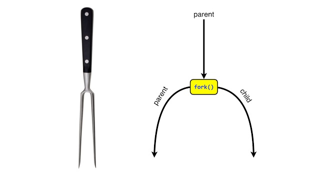

# Procesi 2

Jezgra pokreće `init` proces pri pokretanju sustava, a taj proces onda naknadno stvara sve ostale procese. Tako nastaje hijerarhijska struktura slična (obiteljskom) stablu, gdje svaki proces ima jednog roditelja i može imati više djece.

## Kreiranje procesa

Jedan proces može stvoriti nove procese sistemskim pozivom `fork`, pri čemu su novonastali procesi **kopije** (klonovi) roditeljskog procesa. *Children* procesi kopiraju (nasljeđuju) trenutačno stanje memorije *parent* procesa, ali se izvršavaju nezavisno.

Isječak iz službene dokumentacije:

```bash
man fork | head -n 20 | tail -n 10 && man fork | head -n 115 | tail -
```

```
DESCRIPTION
    fork()  creates  a new process by duplicating the calling process.  The
    new process is referred to as the child process.  The  calling  process
    is referred to as the parent process.

    The child process and the parent process run in separate memory spaces.
    At the time of fork() both memory spaces have the same content.  Memory
    writes,  file  mappings (mmap(2)), and unmappings (munmap(2)) performed
    by one of the processes do not affect the other.

RETURN VALUE
    On success, the PID of the child process is returned in the parent, and
    0  is returned in the child.  On failure, -1 is returned in the parent,
    no child process is created, and errno is set appropriately
```

<div style={{textAlign: 'center'}}>



</div>

### Primjer 1: Hello, World

```c title="P01_hello-world.c"
#include <stdio.h>
#include <sys/types.h>
#include <unistd.h>

int main() {
    printf("Current process PID=%d", getpid());

    pid_t forked_pid = fork();

    printf("\nDid a fork. It returned %d.\n └─ PID = %d, PPID = %d\n",
           forked_pid, getpid(), getppid());

    return 0;
}
```
```bash
gcc P01_hello-world.c -o P01_hello-world && ./P01_hello-world
```

:::info Pitanja
- Koji je PID *child* procesa?
- Zašto ne dolazi do beskonačnog kreiranja novih procesa?
- Zašto se poruka `Current process PID=...` ispisala dva puta?
:::

```c title="P01_hello-world-flush.c"
#include <stdio.h>
#include <sys/types.h>
#include <unistd.h>

int main() {
    printf("Current process PID=%d", getpid());
    fflush(stdout);

    pid_t forked_pid = fork();

    printf("\nDid a fork. It returned %d.\n └─ PID = %d, PPID = %d\n",
           forked_pid, getpid(), getppid());

    return 0;
}
```
```bash
gcc P01_hello-world-flush.c -o P01_hello-world-flush && ./P01_hello-world-flush
```

Kada koristite funkciju `printf()`, C ne ispisuje odmah zadani string, već ga prvo nakratko pohranjuje u privremenu memoriju (međuspremnik). Kada koristite `fork()` za stvaranje novog procesa, *child* proces nasljeđuje međuspremnik od *parent* procesa. Dodavanjem naredbe `fflush(stdout)` prisiljavate C da odmah [ispiše sadržaj međuspremnika i isprazni ga ](https://en.cppreference.com/w/c/io/fflush). Time ujedno i osiguravate da *child* proces naslijedi prazan međuspremnik i izbjegavate moguće *bug*-ove poput dupliciranog ispisa.


```c title="P01_hello-world-sleep.c"
#include <stdio.h>
#include <sys/types.h>
#include <unistd.h>

int main() {
    pid_t forked_pid = fork();
    // Roditelj će završiti odmah, a dijete će prvo čekati nekoliko sekundi
    // te zatim ispisati poruku i završiti
    if (forked_pid == 0) {
        sleep(5);
        printf("Hello world\n");
    }
    return 0;
}
```
```bash
gcc P01_hello-world-sleep.c -o P01_hello-world-sleep && ./P01_hello-world-sleep
```

### Primjer 2: Odnos djeteta i roditelja

U ovom se primjeru *child* proces izvršava neko dulje vrijeme i pri uspješnom izvršavanju šalje roditelju `SIGCHLD` signal koristeći funkciju `_exit()`. *Parent* proces čeka na *child* proces.

```c title="P02_parent-child.c"
#include <stdio.h>
#include <stdlib.h>
#include <sys/wait.h>
#include <unistd.h>

int main() {
    printf("[PARENT] Current PID: %d\n", getpid());
    fflush(stdout);

    pid_t forked_pid = fork();

    if (forked_pid == 0) {
        printf("[CHILD ] Fork returned %d, current PID %d\n", forked_pid,
               getpid());
        sleep(5);
        printf("[CHILD ] Child ends.\n");
        _exit(EXIT_SUCCESS);
    } else if (forked_pid > 0) {
        printf("[PARENT] Fork returned %d, current PID: %d\n", forked_pid,
               getpid());
        printf("[PARENT] Waiting for child ..................\n");
        int status;
        pid_t child_pid = wait(&status);
        printf("[PARENT] Child with PID = %d finished with return value %d\n",
               child_pid, status);
    } else {
        perror("[PARENT] Fork failed");
        return 1;
    }

    return 0;
}
```
```bash
gcc P02_parent-child.c -o P02_parent-child && ./P02_parent-child
```

:::info Pitanje
Kada bi roditelj imao dva djeteta, kojeg bi funkcija `wait` čekala?
:::

## Zadaci za vježbu

### Zadatak 1: Odnos djeteta i roditelja

Nadopunite uvjete kako bi se ispravno ispisivali odnosi između procesa.

```c title="Z01_hierarchy.c"
#include <stdio.h>
#include <unistd.h>

int main() {
    int forked_pid1 = fork();
    int forked_pid2 = fork();
    char* process_name;

    if (/* TODO: Nadopuniti */) {
        process_name = "   PARENT   ";
    } else if (/* TODO: Nadopuniti */) {
        process_name = "FIRST CHILD ";
    } else if (/* TODO: Nadopuniti */) {
        process_name = "SECOND CHILD";
    } else {
        process_name = " GRANDCHILD ";
    }

    printf("[%s] forked_pid1 = %5d, forked_pid2 = %5d, PID = %5d, PPID = %5d\n",
           process_name, forked_pid1, forked_pid2, getpid(), getppid());
    return 0;
}
```
```bash
gcc Z01_hierarchy.c -o Z01_hierarchy && ./Z01_hierarchy
```

### Primjer 3: Fork bomb

Nemojte pokretati ovaj kod:

```c
#include <stdio.h>
#include <unistd.h>

int main() {
    while (1) {
        fork();
    }
    return 0;
}
```


### Zadatak 2: Višestruke kopije

:::info Pitanje
Koliko će se puta ispisati `Hello` kada pokrenemo ovaj kod:
:::

```c
#include <stdio.h>
#include <unistd.h>

int main() {
    fork();
    printf("Hello\n");
    return 0;
}
```


:::info Pitanje
Koliko će se puta ispisati `Hello` kada pokrenemo ovaj kod:
:::

```c
#include <stdio.h>
#include <unistd.h>

int main() {
    fork();
    fork();
    printf("Hello\n");
    return 0;
}
```


:::info Pitanje
Kako bismo mogli ispisati `Hello` točno tri puta?
:::

```c title="Z02_hello-three-times.c"
#include <stdio.h>
#include <unistd.h>

int main() {
    // TODO: Nadopuniti

    return 0;
}
```
```bash
gcc Z02_hello-three-times.c -o Z02_hello-three-times && ./Z02_hello-three-times
```

:::info Pomoć


:::

:::info Pitanje
Koliko će se puta ispisati `Hello` kada pokrenemo ovaj kod:
:::

```c
#include <stdio.h>
#include <unistd.h>

int main() {
    fork();
    fork();
    fork();
    printf("Hello\n");
    return 0;
}
```

:::info Pitanje
Koliko će novih procesa biti kreirano kada pokrenemo ovaj kod:
:::

```c title="Z02_n-copies.c"
#include <stdio.h>
#include <unistd.h>
#define FORK_NUM 3

int main() {
    for (int i = 0; i < FORK_NUM; i++) {
        fork();
        printf("[PID = %5d] i = %d\n", getpid(), i);
    }
    sleep(1);
    printf("[PID = %5d] DONE\n", getpid());
    fflush(stdout);
    return 0;
}
```
```bash
gcc Z02_n-copies.c -o Z02_n-copies && ./Z02_n-copies
```

Pokušajte mijenjati vrijednosti varijable `FORK_NUM` te predvidjeti broj kreiranih procesa.

:::info Pitanje
Zašto se redoslijed ispisa mijenja kada pokrenemo program više puta?  
:::

### Zadatak 3: Korisna djeca

Stvaranje kloniranih procesa nije uvijek praktično jer često želimo kreirati novi proces kako bi obavljao različite zadatke od svog roditelja. 
Prije svega, moramo razlikovati *child* proces od *parent* procesa. Dovoljno je provjeriti povratnu vrijednost funkcije `fork()` (0 za dijete i *child* PID za roditelja). 
Ako želimo *child* proces zadužiti za neku kompleksniju zadaću (za koju možda niti nemamo izvorni kod), možemo koristiti `exec()` [obitelj funkcija](https://linux.die.net/man/3/exec). Ove funkcije pružaju nešto drugačiji API, ali sve zamjenjuju trenutačni proces novim programom. To nam omogućuje izvršavanje gotovo bilo koje binarne datoteke na našem sustavu.

```c title="Z03_ls-child.c"
#include <stdio.h>
#include <stdlib.h>
#include <sys/types.h>
#include <unistd.h>

int main() {
    // Stvaranje novog procesa
    pid_t forked_pid = fork();
    if (forked_pid == -1) {
        perror("Fork failed");
        return 1;
    }

    if (forked_pid == 0) {
        printf("Child running ls...\n");
        // Prvi argument funkcije je putanja do binarne datoteke
        // Nakon toga slijede ostali argumenti odvojeni zarezom
        // Popis argumenata mora završavati s `(char *)NULL`
        execl("/bin/ls", "/bin/ls", "-al", (char*)NULL);
        printf("Child executed ls\n");
    } else {
        printf("Parent terminating...\n");
    }

    return 0;
}
```
```bash
gcc Z03_ls-child.c -o Z03_ls-child && ./Z03_ls-child
```

:::info Pitanje
Zašto se nije ispisala poruka `Child executed ls`?  
:::

Nakon pokretanja programa koji je definiran u `execl` funkciji, proces se više nikada ne vraća u originalni program. Postoji li (hipotetska) situacija u kojoj bi se poruka `Child executed ls` ipak ispisala?

Kreirajte proces koji ispisuje `man` stranicu za Vašu omiljenu naredbu:

```c title="Z03_man-child.c"
#include <stdio.h>
#include <stdlib.h>
#include <sys/types.h>
#include <unistd.h>

int main() {
    // Stvaranje novog procesa
    pid_t forked_pid = fork();
    if (forked_pid == -1) {
        perror("Fork failed");
        return 1;
    }

    if (/* TODO: Nadopuniti */) {
        // TODO: Zadužiti dijete za ispis man stranice
    } else {
        // TODO: Roditelj treba ispisati poruku i završiti
    }

    return 0;
}
```
```bash
gcc Z03_man-child.c -o Z03_man-child && ./Z03_man-child
```

:::info Napomene
- Naredba `man` po zadanim postavkama koristi *pager* (program za pregled i navigaciju kroz tekst, npr. `less`) koji zahtijeva interaktivni terminal. Kada se `man` pokreće s pomoću funkcije `exec`, proces dijete ne prepoznaje ispravno interaktivni terminal, *pager* ne može raditi i dolazi do greške. U nekim okruženjima (npr. Sublime) taj se problem ne pojavljuje jer `man` ne radi u klasičnom terminalu pa ne pokreće *pager*, nego direktno ispisuje rezultat (kao `cat`). Kako biste u terminalu izbjegli grešku, koristite naredbu `man -P cat ...`, čime se isključuje *pager* i dobiva ponašanje slično kao u Sublimeu.
- Ako niste sigurni gdje se nalazi izvršna datoteka za naredbu `man`, možete pokrenuti naredbu `which man`.
:::
