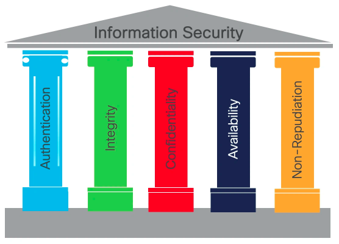
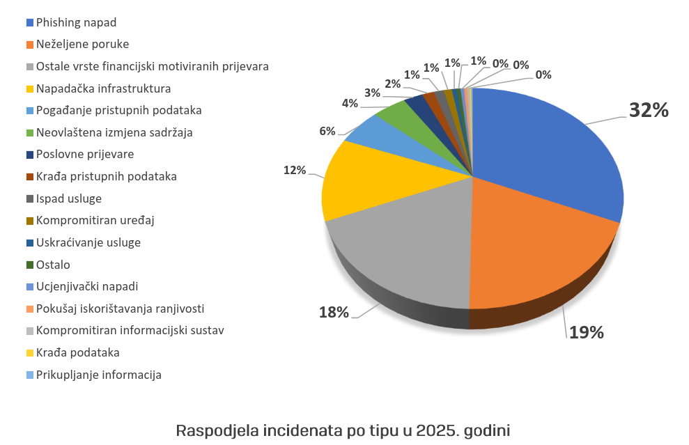
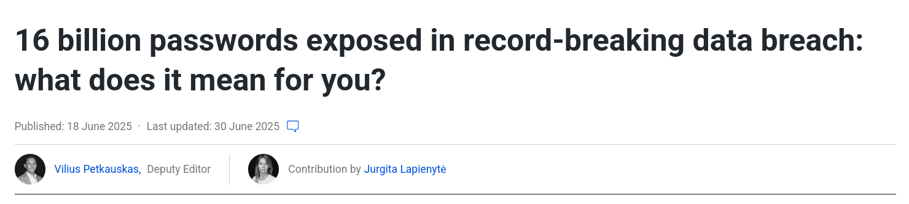
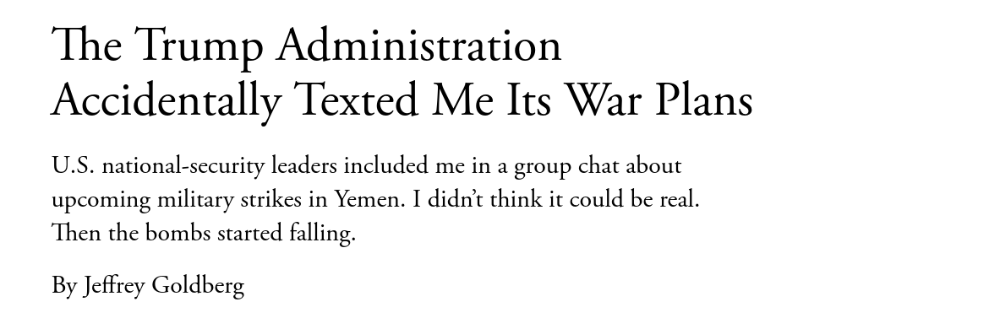
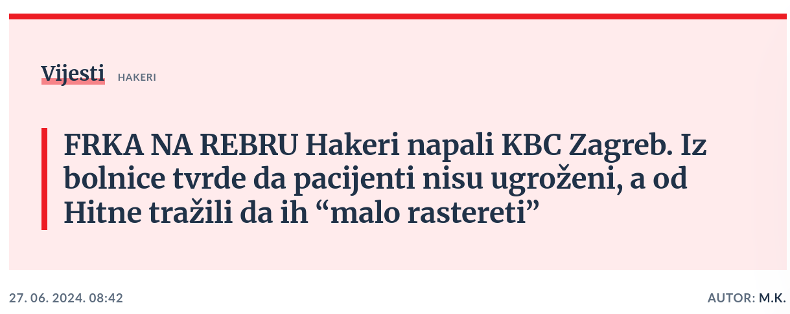
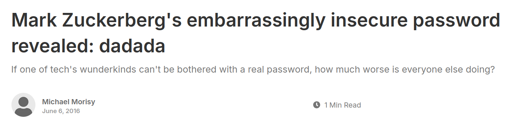

# Računalna sigurnost

import Tabs from '@theme/Tabs';
import TabItem from '@theme/TabItem';
import Admonition from '@theme/Admonition';
import Details from '@theme/Details';

U današnjoj vježbi govorit ćemo o tome zašto je računalna sigurnost odgovornost svakog inženjera i korisnika.

Kako bismo mogli govoriti o sigurnosti, prvo moramo odrediti što nam je važno zaštititi, onda procijeniti što bi moglo poći po zlu, i tek onda odabrati mjere. Zbog toga krećemo od definicija osnovnih [sigurnosnih zahtjeva](https://destcert.com/resources/five-pillars-information-security/) i pojmova koji opisuju problem.

:::info Ponavljanje
- Prisjetite se pojmova kao što su prijetnja, ranjivost, napad i rizik. Kako ih razlikujete?
- Prisjetite se četiri oblika napada na normalan tok informacija. Povežite oblik napada sa sigurnosnim zahtjevom koji je pritom ugrožen.
- Ako znate načela sigurnosne obrane, onda ćete u gotovo svakom sustavu (od OS-a do web aplikacije) brže prepoznati tipične slabe točke i lakše odabrati prave mjere. Koja ste četiri osnovna načela učili na predavanjima?
:::

## Sigurnost u Hrvatskoj i EU

### Tijela koja se brinu o sigurnosti

- [Zavod za sigurnost informacijskih sustava:](https://www.zsis.hr/) Postavlja pravila i nadzire informacijsku sigurnost sustava koji obrađuju državne i klasificirane podatke.
- [Nacionalni centar za kibernetičku sigurnost:](https://ncsc.hr/) Koordinira kibernetičku sigurnost na razini države i provedbu NIS2 regulative i srodnih zakona.
- [***Computer Emergency Response Team:***](https://www.cert.hr) Zaprima i obrađuje incidente te objavljuje upozorenja i preporuke građanima.
- [Hrvatska akademska i istraživačka mreža:](https://www.carnet.hr/) Pruža Internet i digitalne servise školama i akademskoj zajednici te podršku za sigurnost tih sustava.
- [Agencija za zaštitu osobnih podataka:](https://azop.hr/) Provodi GDPR, daje mišljenja i može izricati mjere ili kazne.
- [*European Union Agency for Cybersecurity:*](https://www.enisa.europa.eu/) Objavljuje izvještaje i smjernice te pomaže državama članicama EU u jačanju kibernetičke sigurnosti.
- [CERT-EU:](https://cert.europa.eu/) Prati prijetnje i koordinira odgovor na incidente unutar EU tijela.
- [*European Data Protection Board:*](https://www.edpb.europa.eu/) Usklađuje tumačenje i primjenu GDPR-a kroz smjernice i odluke.
- [*European Cybercrime Centre:*](https://www.europol.europa.eu/about-europol/european-cybercrime-centre-ec3) Podržava policije u borbi protiv kibernetičkog kriminala (istrage, koordinacija, analitika).

### Zakonodavstvo

- [NIS2 direktiva (2022):](https://eur-lex.europa.eu/legal-content/EN/TXT/?uri=CELEX:32022L2555) EU pravila koja uvode minimalne sigurnosne mjere i obvezu prijave incidenata za organizacije koje pružaju ključne ili važne usluge, s ciljem da se incidenti rjeđe događaju i da se brže kontroliraju.
- [Zakon o kibernetičkoj sigurnosti (2024):](https://www.zakon.hr/z/3718/zakon-o-kibernetickoj-sigurnosti) Prenosi EU NIS2 direktivu u nacionalno pravo. Računalna sigurnost postaje zakonska obveza za ključne ili važne organizacije (npr. energija, zdravstvo, financije, digitalna infrastruktura i sl.). Kad se dogodi incident, **CERT.hr je prvi telefon**. NIS2 obveznici su dužni prijaviti rano upozorenje u roku od 24 sata, a detaljnu obavijest unutar 72 sata.
- [Zakon o informacijskoj sigurnosti (2007):](https://www.zakon.hr/z/218/zakon-o-informacijskoj-sigurnosti) Stariji zakon koji je i dalje relevantan za državni i javni sektor i sustave s osjetljivim podacima.
- [*General Data Protection Regulation (2016):*](https://gdpr-info.eu/) Morate znati koje podatke smijete prikupljati i kako ih zaštititi kako biste izbjegli štetu korisnicima i ozbiljne kazne za organizaciju.
- [*EU AI Act:*](https://ai-act-law.eu/) Klasificira AI sustave po procjenjenoj razini rizika za organizacije i korisnike.
- [*CSA Regulation (Chat Control):*](https://eur-lex.europa.eu/legal-content/EN/TXT/?uri=COM:2022:209:FIN) EU prijedlog uredbe koja bi obvezala *messaging* servise (WhatsApp, Signal, Telegram, Messenger...) na skeniranje sadržaja prije šifriranja radi otkrivanja materijala seksualnog zlostavljanja djece.

:::info Diskusija
*End-to-end* enkripcija koja je standard u današnjim *messaging* servisima znači da poruku mogu pročitati samo pošiljatelj i primatelj, a ne tvrtka koja je izgradila aplikaciju ili vlada. *Chat Control* bi tražio *client-side scanning*, gdje bi uređaj skenirao sadržaj prije nego što ga enkriptira i šalje putem mreže. Ovaj prijedlog je pokrenuo brojne rasprave jer ga njegovi **zagovornici** vide kao nužan alat za zaštitu djece, a **protivnici** upozoravaju da time nastaje infrastruktura za masovni nadzor koja se može zloupotrijebiti, da narušava pretpostavku nevinosti (svi korisnici su od početka potencijalni osumnjičenici) i da otvara *backdoor* koji mogu iskoristiti i napadači. Ova tema je idealan primjer **konflikta sigurnosnih ciljeva:** zaštita jedne ranjive skupine direktno direktno je u sukobu s privatnošću ostalih korisnika. Kao inženjeri ćete biti dio sustava koji ovo implementiraju ili odbijaju implementirati.
:::

### Brojke iz Hrvatske

## Stare prijetnje, novi izgled

### *Phishing*

*Phishing* (putem e-maila), *smishing* (putem SMS-a) i *vishing* (putem poziva) su i dalje među najčešćim ulaznim vektorima. **Lakše je prevariti čovjeka da klikne link, preda lozinku ili pokrene datoteku nego hakirati kriptografiju.** AI iz dana u dan ojačava ovu klasu napada. Danas su ovakve poruke jezično uredne i personalizirane na temelju javno dostupnih podataka, a mogu se masovno generirati i brzo prilagođavati. Zbog toga se sve teže možemo osloniti na intuiciju. Obrana se sve više svodi na jasne postupke i tehničke mjere (provjera pošiljatelja i domene, potvrda zahtjeva drugim kanalom, 2FA, oprez s privitcima i poveznicama). Uz to, kao i uvijek, ključna je kontinuirana edukacija korisnika.

Neke od aktualnih i nedavnih kampanja u Hrvatskoj:
- SMS prijevara s plaćanjem kazni (lažna stranica za plaćanje prometnih prekršaja). [Poveznica](https://www.cert.hr/upozorenje-u-tijeku-je-sms-prijevara-s-placanjem-kazni/)
- Lažne internetske trgovine koje ciljaju Hrvate. [Poveznica](https://www.cert.hr/upozorenje-napadaci-kreiraju-lazne-stranice-hrvatskih-tvrtki/)
- Investicijske prijevare i prijevare s povratom novca (oglasi/pozivi koji traže token ili kartične podatke). [Poveznica](https://www.cert.hr/upozorenje-hrvatska-na-udaru-investicijskih-prijevara-i-prijevara-s-povratom-novca/)
- Lažne stranice koje imitiraju sustav e-Građani s ciljem krađe pristupnih vjerodajnica i tokena mobilnog bankarstva. [Poveznica](https://www.cert.hr/upozorenje-stranice-koje-imitiraju-sustav-e-gradani/)
- Scam kampanja: lažna obavijest o pozivu policije (zastrašivanje i pokušaj iznude podataka). [Poveznica](https://www.cert.hr/upozorenje-scam-kampanja-u-tijeku-obavijest-o-pozivu-policije/)
- Facebook prijevara *"Pogledajte tko je posjetio vaš profil"* (kompromitacija računa). [Poveznica](https://www.cert.hr/facebook-prijevara-pogledajte-tko-je-posjetio-vas-profil/)
- Širenje malvera oponašanjem obavijesti sustava eDozvola (zlonamjerni privitak, krađa lozinki). [Poveznica](https://www.cert.hr/upozorenje-sirenje-malvera-oponasanjem-obavijesti-sustava-edozvola/)
- Smishing kampanja u kojima se napadači predstavljaju kao HEP i tvrde kako je potrebno podmiriti dugovanje što prije kako ne bi došlo do obustave usluge. [Poveznica](https://www.cert.hr/upozorenje-napadaci-se-i-dalje-predstavljaju-kao-hep-te-prijete-iskljucivanjem-struje/)
- Roditelji na meti prevaranata: *"Dijete u nevolji"* (pokušaj prijevare i zahtjev za uplatom). [Poveznica](https://www.cert.hr/upozorenje-roditelji-su-opet-na-meti-prevaranata/)

*Voice cloning* je danas dovoljno uvjerljiv da [samo tri sekunde](https://www.ibtimes.com/3-seconds-audio-all-generative-ai-needs-enable-voice-scams-researchers-say-3699784) javno dostupnog glasa (npr. Instagram ili TikTok video) može poslužiti za generiranje lažnog hitnog poziva vašim roditeljima ili bakama i djedovima. Zato glas više nije dokaz identiteta: **upozorite članove obitelji** da provjere priču preko poznatog broja, a ako imate dogovorenu tajnu riječ *(family safe word),* da je zatraže prije slanja novca ili dijeljenja podataka.

### *Deepfakes*

*Deepfakes* se sve češće koriste za prijevare: od lažnih oglasa s poznatim licima do poslovnih video-poziva u kojima se napadači predstavljaju kao uprava tvrtke:

- Slučaj poslovne prijevare u Singapuru u kojem je financijski direktor jedne multinacionalne tvrtke kontaktiran putem WhatsAppa od osobe koja se predstavljala kao njegov nadređeni. Nakon toga je uključen u Zoom videokonferenciju na kojoj su *deepfake* tehnologijom oponašani CEO i drugi članovi vodstva. Dobio je i izvršio uputu za hitan transfer od gotovo pola milijuna dolara. Tek kad je od njega zatražen dodatni transfer od 1,4 milijuna dolara, postalo je jasno da se radi o prijevari. [Poveznica](https://www.police.gov.sg/media-hub/news/2025/04/20250407_singapore_and_hong_kong_police_force_recover_over_%24670000_in_a_scam)
- Francuski predsjednik Emmanuel Macron je na svom službenom profilu objavio video u kojem se osvrnuo na to kako *deepfakes* mogu ostaviti dojam da je riječ o bezazlenoj zabavi, ali istovremeno mogu dovesti do realnih rizika.

<blockquote class="twitter-tweet">
Bien joué… <a href="https://t.co/zthA2zIBja">pic.twitter.com/zthA2zIBja</a>
&mdash; Emmanuel Macron (@EmmanuelMacron) <a href="https://twitter.com/EmmanuelMacron/status/1888589398620389708?ref_src=twsrc%5Etfw">February 9, 2025</a></blockquote>  

- Dodatno industrijsko istraživanje. [Poveznica](https://www.gendigital.com/blog/insights/research/ai-generated-personas-deepfake-tactics-scam-yourself-attacks)

### *Credential stuffing*

*Credential stuffing* je napad u kojem se **jedna procurjela lozinka isprobava na mnogo drugih servisa. Ako je lozinka ista ili slična, napadač može preuzeti Gmail, Instagram ili bankovni račun.** Posljedice su krađa novca, kompromitacija društvenih računa i krađa identiteta, osobito ako su računi povezani s privatnim podacima ili fotografijama.

## To se ne može dogoditi meni!

Osnovne greške rade građani, ministri, voditelji institucija i *tech* kompanija.

Ono što svi ovi primjeri imaju zajedničko jest loša politika korištenja alata, korištenje slabih lozinka, nedostatak 2FA, loš proces i **ljudski faktor.**

### *The Human Factor*

- Ni najbolji sigurnosni alati ne pomažu ako ih ljudi zanemaruju ili krivo koriste.
- Pogreške rade korisnici, administratori i menadžeri.
- Izgovori su obično isti: "Lakše je ovako", "Nemamo novaca za to" ili "Zaboravio sam".
- Ljudi otvaraju spam poštu, ponovno koriste iste lozinke, isključuju sigurnosne postavke i ignoriraju ažuriranja.
- Napadači pritom iskorištavaju ljudske slabosti: igraju na emocije, stvaraju osjećaj hitnoće, računaju na strah od autoriteta, loše navike i umor.
- Jedino trajno rješenje je **edukacija.**

### Posljedice

- **Za fizičke osobe** posljedice su najčešće krađa identiteta, financijski gubitak i osjećaj straha ili srama. Važno je ne kriviti žrtve nego ih zaštititi, promijeniti lozinke i po potrebi deaktivirati bankovne kartice.
- **Za pravne osobe** posljedice su prekid poslovanja, financijski gubitak, gubitak ugleda, povreda intelektualnog vlasništva i pravne posljedice.
- **Za vas** kao buduće inženjere to znači i osobnu odgovornost: jedna greška može koštati firmu milijune ili završiti otkazom.

## AI

:::info AI pojačava napade
Razmislite na koje sve načine AI danas može unaprijediti već dobro poznate napade.
:::

:::info AI propušta tajne

[Alati za analizu otvorenog koda](https://www.gitguardian.com/state-of-secrets-sprawl-report-2026) otkrili su:
- **~29 milijuna tajni** (API ključeva, lozinki, tokena) u javnim GitHub repozitorijima u 2025., 34% više u odnosu na prethodnu godinu (najveći skok ikad)
- Commitovi nastali uz pomoć AI-ja izlažu tajne **dvostruko češće** od uobičajenog rada
- **113 000 procurjelih DeepSeek API ključeva** u 2025.
- **64%** tajni potvrđenih kao valjanih u 2022. još uvijek je bilo iskoristivo u siječnju 2026. (čak četiri godine nakon što su procurile)

Zašto se ovo događa? Kada neiskusan programer traži od Claudea ili Copilota da napiše skriptu, a AI ubaci primjer s *placeholderom* za ključ, često će se dogoditi da ga korisnik zamijeni pravim podatkom i zatim slučajno objavi na GitHubu. Skeneri takve tajne često pronađu za nekoliko minuta, a napadač ih onda može odmah iskoristiti.
:::

:::info Novi vektori specifični za AI
Istražite nove vektore specifične za AI (neke od ovih ćete možda slušati od svojih kolega na seminarima):
- *Prompt injection*
- *Slopsquatting*
- MCP konfiguracije
:::

:::info AI pomaže obrani
Prisjetite se načina na koje AI može pomoći u obrani, a koje ste učili na predavanjima.
:::

## Cybersec kao struka

Ako se želite baviti cybersecurityjem, ovo su neke od uloga koje bi vas mogle zanimati:

- **Pentester:** Pokušava provaliti u sustav da bi pronašao slabe točke prije napadača.
- **SOC analyst:** Prati logove i reagira kad se dogodi incident.
- **Security engineer:** Gradi sigurne sustave od početka.
- **Forensics:** Istražuje što se dogodilo nakon incidenta.
- **Governance, Risk, Compliance:** Brine da organizacija prati propise i interne sigurnosne politike.
- **AppSec/DevSecOps:** Ugrađuje sigurnost u razvoj aplikacija i infrastrukture.
- **Threat intelligence:** Prati napadače, njihove alate i tehnike.

### Capture The Flag natjecanja

CTF natjecanja su dobar uvod za studente koji se jednog dana žele baviti cybersecurity-jem. U njima je cilj riješiti zadatak, pronaći *flag* i predati ga sustavu za bodove.

**Kategorije:**

- **Web:** SQL injection, XSS, autentikacijske greške, IDOR i SSRF.
- **Crypto:** Razbij ili shvati šifriranje.
- **Reverse Engineering:** Analiziraj *binary file* i shvati što program radi bez izvornog koda.
- **Pwn/Binary Exploitation:** Iskorištava *memory bugove* poput *buffer overflow* ili *use-after-free*.
- **Forensics:** Istražuje što se dogodilo nakon incidenta kroz datotečni sustav, mrežne zapise i memoriju.
- **OSINT:** Traži informacije o nekome iz javnih izvora.
- **Misc:** Sve ostalo, od zagonetki i steganografije do programiranja pod pritiskom.

**Poveznice:**

- [picoCTF](https://picoctf.org/)
- [HackTheBox](https://www.hackthebox.com/)
- [TryHackMe](https://tryhackme.com/)
- [OverTheWire](https://overthewire.org/wargames/)
- [Root-Me](https://www.root-me.org/)
- [pwn.college](https://pwn.college)
- [Hackultet](https://platforma.hackultet.hr/)

## Resursi za daljnji rad

- [FER Natjecateljske vještine u kibernetičkoj sigurnosti](https://ctf.xfer.hr)
- [CTF101](https://ctf101.org/)
- [OWASP Top 10](https://owasp.org/www-project-top-ten/)
- [Hacker Highschool](https://www.hackerhighschool.org/lessons.html)
- [Darknet Diaries](https://darknetdiaries.com/)
- [Krebs on Security](https://krebsonsecurity.com/)
- [Iz perspektive bivših hakera](https://www.youtube.com/watch?v=SKVnR91ed5g)
- [Iz perspektive bivših hakera](https://www.youtube.com/watch?v=aUqes9QdLQ4)
- [Have I Been Pwned](https://haveibeenpwned.com/)
- [Personal Security Checklist](https://digital-defense.io/)
- [Security, privacy, and Anonymity Quiz](https://techlore.tech/spa/)
- Nalazi li se tvoja lozinka na nekoj od [ovih](https://github.com/kiloquad/__SecLists/blob/master/Passwords/10_million_password_list_top_1000.txt) [stranica](https://github.com/RykerWilder/rockyou.txt)? Ako da, napadač može dobiti pristup tvom računu u samo nekoliko sekundi.

