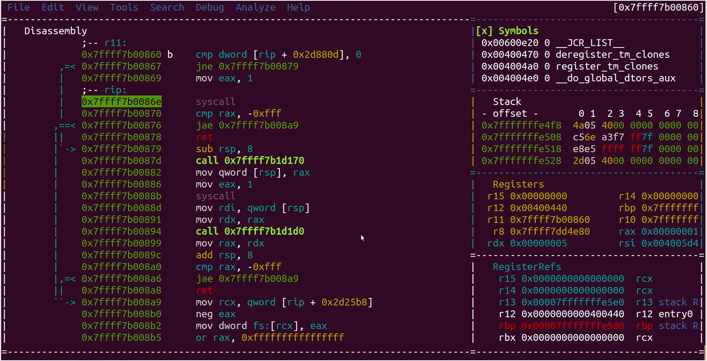

# Sistemski pozivi 2

import Tabs from "@theme/Tabs";
import TabItem from "@theme/TabItem";

Prošli smo tjedan govorili o tome kako procesori koriste različite razine privilegija kako bi se osigurala stabilnost sustava. Razlikovali smo **jezgreni** i **korisnički** način rada i predstavili sistemske pozive kao sučelje putem kojeg korisnički programi komuniciraju s OS-om i zahtijevaju njegove usluge. Naveli smo vrste sistemskih poziva, upoznali se sa `strace` alatom i komentirali [razlike](https://www.reddit.com/r/learnpython/comments/4w0wav/system_calls_for_the_hello_world_program_in/) između C, Bash i Python programa.

## Kako funkcioniraju sistemski pozivi?

Prisjetimo se primjera iz prošlotjedne vježbe:

```c title="P01_hello-world.c"
#include <stdlib.h>
#include <stdio.h>

int main(int argc, char const *argv[]) {
    int day = 20, month = 4, year = 2024;
    printf("%d. %d. %d.\n", day, month, year);
    return 0;
}
```
```bash
gcc P01_hello-world.c -o P01_hello-world
strace ./P01_hello-world
```

Iako koristimo funkciju `printf`, ona je zapravo samo *wrapper* iz standardne C biblioteke `libc` koji u pozadini priprema registre i poziva sistemski poziv `write`.

Struktura i sadržaj binarne datoteke može se vizualizirali uz pomoć dijagnostičkih alata poput [radare2](https://rada.re/n/radare2.html). Na slici je prikazan poziv funkcije `write` kako bismo bolje razumjeli kako se program ponaša tijekom izvršavanja:



Obratite pozornost na dvije linije:

```bash
mov eax, 1
syscall
```

Prijelaz iz korisničkog (razina privilegije 3) u jezgreni (razina privilegije 0) način rada inicira se asemblerskom instrukcijom `syscall`. U tom trenutku jezgra preuzima kontrolu i pokreće rutinu zvanu *system call handler*, koja:

- Treba prepoznati koji sistemski poziv korisnik želi izvršiti (jer postoji mnogo različitih sistemskih poziva).
- Učitava identifikacijski broj sistemskog poziva iz `eax` registra i provjerava njegovu valjanost.
- Koristi [tablicu sistemskih poziva](https://filippo.io/linux-syscall-table/).
- Pronalazi fiksnu memorijsku adresu na kojoj je definiran željeni sistemski poziv.

Jezgra izvršava zadatak, a zatim vraća rezultat programu i vraća procesor u korisnički način rada. [Više o *system call handler*-u.](https://litux.nl/mirror/kerneldevelopment/0672327201/ch05lev1sec3.html)

## Specifičnosti operacijskih sustava

Dok je Linux otvoren sustav gdje možemo vidjeti cijelu tablicu sistemskih poziva i njihov izvorni kod, Windows OS funkcionira kao "crna kutija". Izvorni kod jezgre nije javno dostupan, što znači da ni inspekcija koda sistemskih poziva nije dostupna. Kako bi programeri svejedno mogli razvijati softver koji komunicira s Windows OS, dokumentacija o tome kako koristiti [Win32 API](https://learn.microsoft.com/en-us/windows/win32/) je javno dostupna.

## Zadaci za vježbu

### Zadatak 1: Tablica kvadrata

Tablica kvadrata pruža prethodno izračunate vrijednosti kvadrata za različite ulazne vrijednosti. Napišite program koji generira tablicu kvadrata i zapisuje ju u datoteku. Ime datoteke te početna i konačna vrijednost za koju je potrebno izračunati kvadrat zadaju se kao CLI argumenti programu. Ako zadana datoteka ne postoji potrebno ju je dodati, a ako postoji potrebno je izbrisati sav sadržaj iz nje prije zapisa tablice drugog korijena.

<Tabs>
  <TabItem value="c" label="Primjer u C-u">

```c title="Z01_sqr.c"
#include <stdlib.h>
#include <stdio.h>

int main(int argc, char const *argv[]) {
    // Program prima tri argumenta, i to redom: filename, from, to
    if (argc < 4) {
        perror("Please provide all args");
        return 1;
    }

    // Učitati argumente koje je proslijedio korisnik
    const char *filename = argv[1];
    int from, to;
    sscanf(argv[2], "%d", &from);
    sscanf(argv[3], "%d", &to);

    // Otvoriti datoteku imena filename
    FILE *fp = fopen(filename, "w");
    if (fp == NULL) {
        perror("Can't open output file");
        return 1;
    }

    // Zapisati zaglavlje tablice u datoteku
    if (fprintf(fp, "N\tSQR(N)\n") < 0) {
        perror("Error writing output file");
        return 1;
    }
    // Popuniti tablicu kvadrata
    for (int i = from; i <= to; i++) {
        if (fprintf(fp, "%d\t%d\n", i, i * i) < 0) {
            perror("Error writing output file");
            return 1;
        }
    }

    // Zatvoriti datoteku
    if (fclose(fp) != 0) {
        perror("Error on close");
        return 1;
    }
    return 0;
}
```
```bash
gcc Z01_sqr.c -lm -o Z01_sqr
strace -c ./Z01_sqr Z01_sqr.txt 4 12
cat Z01_sqr.txt
```

  </TabItem>
  <TabItem value="bash" label="Bash predložak">

```bash title="Z01_sqr.sh"
#!/bin/bash

# Program prima tri argumenta, i to redom: filename, from, to
# TODO: Učitati argumente koje je proslijedio korisnik
# filename=...
# from=...
# to=...

# TODO: Zapisati zaglavlje tablice u datoteku imena filename
# ...

# TODO: Popuniti tablicu kvadrata (koristiti petlje u Bashu)
# Izračunati kvadrat brojeva u rasponu [from, to] i zapisati rezultat u datoteku
# ...
```
```bash
chmod +x Z01_sqr.sh
rm Z01_sqr.txt
strace -c ./Z01_sqr.sh Z01_sqr.txt 8 20
cat Z01_sqr.txt
```
:::info Napomena
Za generiranje niza brojeva od početne do krajnje vrijednosti u for petlji možete koristiti naredbu `for i in $(seq $from $to)`.
:::
  </TabItem>
</Tabs>

Komentirajte vrijeme izvršavanja programa za kreiranje tablice kvadrata brojeva pisanog u C-u i u Bashu. Vrijeme izvršavanja naredbe, programa ili skripte možemo dobiti koristeći naredbu `time`. [Više o mjerenju vremena izvršavanja.](https://stackoverflow.com/a/47478852/11497334)

```bash
rm Z01_sqr.txt
time ./Z01_sqr Z01_sqr.txt 4 5000
rm Z01_sqr.txt
time ./Z01_sqr.sh Z01_sqr.txt 4 5000
```

### Zadatak 2: Kopiranje sadržaja datoteke

Pokrenite sljedeću naredbu kako biste stvorili datoteku veličine 100 MiB:

```bash
dd if=/dev/zero of=Z02.data bs=1M count=100
```

U terminalu pokrenite naredbu koja će kopirati sadržaj datoteke `Z02.data` u `Z02_kopija.data`. Sadržaj treba kopirati u blokovima, s time da:
- U prvom slučaju koristite blokove maksimalne veličine 1 MiB (1024 * 1024 bajtova)
- U drugom slučaju koristite blokove maksimalne veličine 20 MiB (20 * 1024 * 1024 bajtova)

Usporedite ova dva scenarija.

:::info Pomoć
- Kopiranje datoteke u blokovima je moguće realizirati koristeći alat `dd`
- Nazivi ulazne i izlazne datoteke se definiraju s pomoću parametara `if` *(input file)* i `of` *(output file)*, npr. `dd if=in.txt of=out.txt`
- S pomoću parametra `bs` *(block size)* može se definirati maksimalna veličina bloka u bajtovima prilikom kopiranja. Moguće je koristiti i sufikse M, MB, K, KB, ...
:::

### Zadatak 3: Održavanje i informacije sustava

Iskoristite dani predložak i napišite C program koji ispisuje:
- Proteklo vrijeme od pokretanja sustava u minutama
- Količinu radne memorije te koliko je radne memorije slobodno u bajtovima
- Veličinu diskovnog prostora i slobodnog prostora za `/home/student`
- Unutar programa provjerite je li se funkcija `statvfs` uspješno izvršila

```c title="Z03_sysinfo.c"
#include <stdio.h>
#include <stdlib.h>
#include <sys/statvfs.h>
#include <sys/sysinfo.h>

int main(int argc, char const* argv[]) {
    struct sysinfo info;
    int ret = sysinfo(&info);
    if (ret == -1) {
        perror("An error occurred");
        return 1;
    }

    // TODO: printf("SYSTEM UPTIME: ... min\n", ...);
    printf("\n");
    printf("MEMORY:\n");
    // TODO: printf("\tTotal RAM: ... B\n", ...);
    // TODO: printf("\tFree RAM: ... B\n", ...);
    printf("\n");

    struct statvfs stat;
    ret = statvfs("/home/student", &stat);
    if (/* TODO: Provjeriti je li funkcija `statvfs` javila grešku */) {
        perror("An error occurred");
        return 1;
    }

    printf("DISK USAGE /home/student:\n");
    // TODO: printf("\tTotal: ... B\n", ...);
    // TODO: printf("\tFree: ... B\n", ...);

    return 0;
}
```
```bash
gcc Z03_sysinfo.c -o Z03_sysinfo && ./Z03_sysinfo
```

:::info Napomene
- Ispravnost svog programa provjerite tako da ispise usporedite s ispisima naredbi `uptime`, `free -b` i `df -B 1`.
- Koristite dokumentaciju prilikom rješavanja zadatka: `man sysinfo` i `man statvfs`.
- Istražite [specifikacije](https://www.tutorialspoint.com/cprogramming/c_format_specifiers.htm) `printf` formata za različite tipove varijabli (npr. `long`, `unsigned long`, `unsigned int`, `unsigned short`)  
:::
